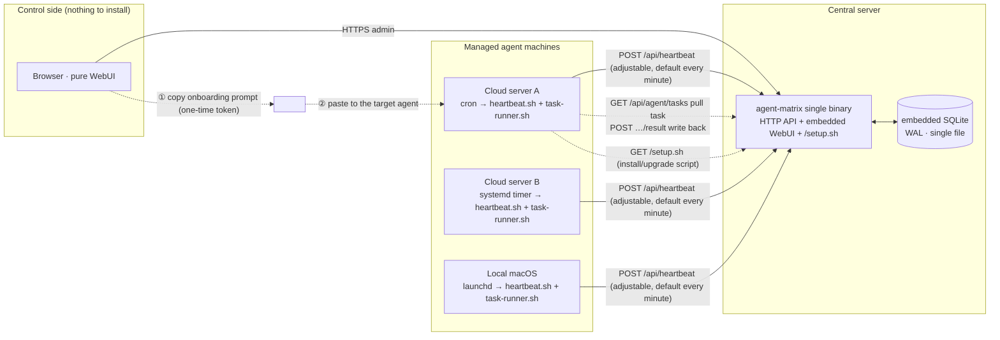
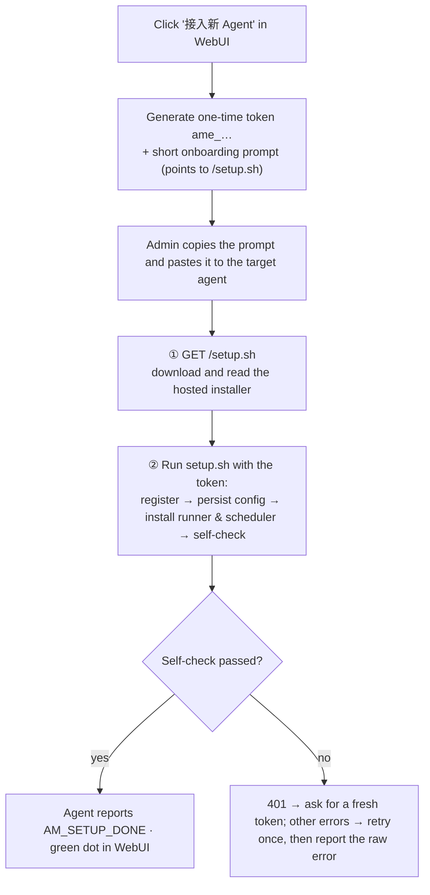
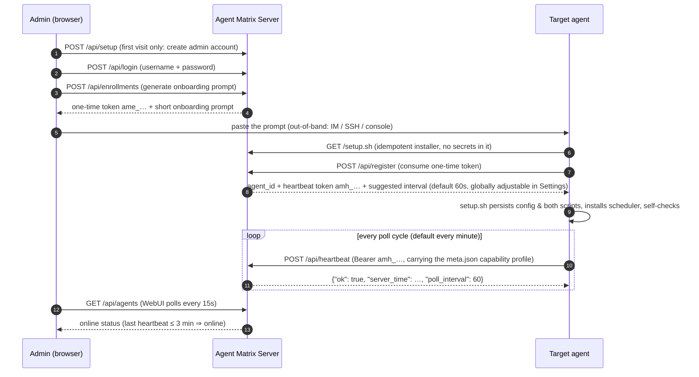
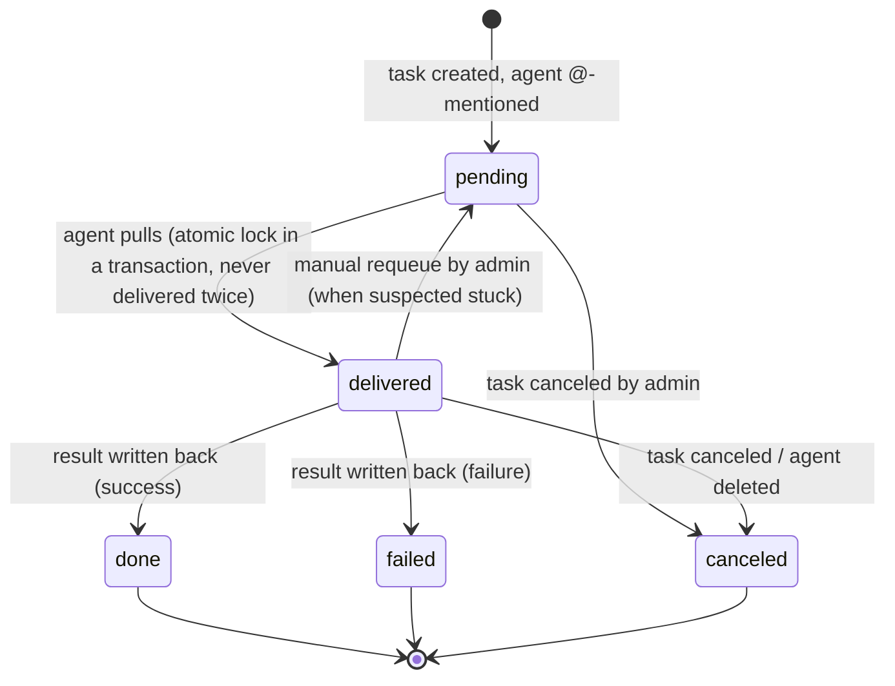

# Agent Matrix

[](https://go.dev/dl/) [](LICENSE) [](https://github.com/HankGuo/agent-matrix/releases) [](https://github.com/HankGuo/agent-matrix)

[中文文档](README.md)

<br>

> A lightweight **agent registry, online-status monitor, and plain-text task dispatcher**. No daemon to install on any machine — generate a **short onboarding prompt** in the WebUI and hand it to the agent with shell access. The agent downloads the server-hosted idempotent installer `setup.sh`, registers, persists config, and installs heartbeat + task runner in one shot. The admin console is pure browser; the agent side is pure outbound access. Linux / macOS only; the only supported agent executors are OpenClaw and Hermes Agent.

<br>


<br>

<!-- TOC -->

## 📖 Table of Contents

- [🎯 Features](#-features)
- [🧩 Architecture](#-architecture)
- [📋 Onboarding Flow](#-onboarding-flow)
- [⚡ Quick Start](#-quick-start)
  - [Build](#build)
  - [Run](#run)
  - [Environment Variables](#environment-variables)
  - [Production Deployment](#production-deployment)
- [📝 Usage](#-usage)
- [📬 Task Dispatch](#-task-dispatch)
  - [Attachment Pipeline](#attachment-pipeline)
  - [Multi-Round & Session Binding](#multi-round--session-binding)
  - [Assignment State Machine](#assignment-state-machine)
- [📦 Sample Onboarding Prompt](#-sample-onboarding-prompt)
- [🔧 What setup.sh Does](#-what-setupsh-does)
- [🔄 Upgrading](#-upgrading)
- [🔌 API Summary](#-api-summary)
- [❓ FAQ](#-faq)
- [🎨 Design Philosophy](#-design-philosophy)
- [📄 License](#-license)

---

## 🎯 Features

| 🚀 | **Prompt-guided + hosted installer** | The onboarding prompt is a dozen lines; all static logic lives in the idempotent `setup.sh` — change logic without touching prompts, re-run to upgrade |
| 👤 | **Capability Profile** | At registration the agent self-reports persona / model / skills; executor version is auto-detected, so the card tells you at a glance who's good at what |
| 📋 | **Task Dispatch (text + attachments + follow-ups)** | @ one or more agents; pull-to-lock means no duplicate delivery, write-back is single-shot; append rounds from the detail page with continuous context |
| 🔐 | **Security Model** | One-time enrollment tokens + separate heartbeat tokens; passwords stored salted with PBKDF2-SHA256; only hashes in the database |
| 🖥️ | **Pure WebUI Admin** | The admin machine needs nothing but a browser; task kanban (running / done / failed·canceled), auto-refresh every 15 seconds |
| 🛠️ | **Zero-Dependency Deployment** | One static binary + embedded SQLite, systemd up in seconds; built-in rate limiting and security headers |

---

## 🧩 Architecture

Between the server and agent machines there are **only agent-initiated outbound requests** (script download / heartbeat / task pull / result write-back) — no inbound connectivity required. The onboarding prompt travels out-of-band via the admin's clipboard; nothing needs to be preinstalled on the agent side.



---

## 📋 Onboarding Flow



### Registration & Heartbeat Sequence



---

## ⚡ Quick Start

### Build

Requires **Go ≥ 1.24** (developed on 1.26):

```bash
git clone https://github.com/HankGuo/agent-matrix.git
cd agent-matrix
go build -o agent-matrix .
```

Or:

```bash
go install github.com/HankGuo/agent-matrix@latest
```

### Run

```bash
export AGENT_MATRIX_BASE_URL='https://matrix.example.com'  # public URL, baked into prompts
./agent-matrix
```

Open `http://localhost:26817` (or your domain).

> ⚠️ **The first visit forces an initial-setup page**: create an admin username and password (stored salted with PBKDF2-SHA256), and optionally set the platform base URL right there. Once set up, all admin APIs and the dashboard require this account; the base URL can be changed anytime under "设置" (Settings).

### Environment Variables

| Variable | Default | Description |
|---|---|---|
| `AGENT_MATRIX_ADDR` | `:26817` | HTTP listen address |
| `AGENT_MATRIX_DB` | `./agent-matrix.db` | SQLite database path |
| `AGENT_MATRIX_BASE_URL` | `http://localhost:26817` | Public URL used in onboarding prompts. Can also be changed in WebUI Settings after deployment — **WebUI setting takes precedence** |
| `AGENT_MATRIX_ONLINE_TIMEOUT` | `3m` | Mark offline after this long without heartbeat |
| `AGENT_MATRIX_ATTACH_DIR` | `<DB dir>/attachments` | Attachment storage directory (mount point); back it up together with the DB |
| `AGENT_MATRIX_ADMIN_TOKEN` | empty (optional) | Emergency login token. If set, the login page can use it instead of username+password (e.g. forgotten password); without it, account login is the only path |

### Production Deployment

**systemd** with `Restart=always`:

```ini
[Unit]
Description=Agent Matrix
After=network.target

[Service]
Environment=AGENT_MATRIX_BASE_URL=https://matrix.example.com
Environment=AGENT_MATRIX_DB=/var/lib/agent-matrix/agent-matrix.db
ExecStart=/usr/local/bin/agent-matrix
Restart=always
RestartSec=3

[Install]
WantedBy=multi-user.target
```

- **HTTPS reverse proxy (Caddy)**: `matrix.example.com { reverse_proxy 127.0.0.1:26817 }`; firewall everything except 443
- **Backup**: back up the single file at `AGENT_MATRIX_DB` (contains the admin account, agent list, and session keys)

---

## 📝 Usage

1. Click "接入新 Agent" (top right) → optional name → generate prompt → copy
2. **Paste the prompt verbatim to the target agent** (into its chat/CLI)
3. The agent reports back the self-check output: registration result, executor command, scheduler type, registered profile
4. Back in the WebUI, a green dot means it's online
5. Switch to the "任务" (Tasks) tab → new task → write title & content, tick one or more agents → create
6. The agent pulls the task within a minute and executes autonomously; click a task card to open the detail thread and see each agent's status and full result per round
7. To dig further, type a new instruction into "继续任务" at the bottom of the detail page and send: same task, same agent session, continuous context — or tick extra agents to pull them in

> ⚠️ **Note**: the target agent must be able to **run shell commands and create scheduled jobs**. A chat-only agent (e.g. some vendor-hosted IM bots) cannot onboard itself — that's a mechanical constraint, not a configuration issue.

---

## 📬 Task Dispatch

The admin writes a task on the "任务" (Tasks) page and @-mentions one or more enrolled agents, optionally with up to 10 attachments (≤100MB each, each with its own caption). On each agent machine, `task-runner.sh` pulls tasks on the configured poll interval (default every minute, globally adjustable in Settings), **executes them through the agent's own one-shot CLI command** (auto-detected at setup in the order openclaw → hermes), and **mechanically writes the result back** based on the exit code — nothing depends on the agent remembering conventions. Everything is an outbound request from the agent — NAT- and firewall-friendly by construction, no callback networking to solve.

> ⚠️ **Executor requirements**: only two executors are supported — OpenClaw and Hermes Agent — and only on Linux / macOS.
> - **OpenClaw**: `setup.sh` probes `openclaw agent --help` at runtime and adapts automatically (`--session-key` → `--session-id` → `--to`, three degradation tiers); no fixed version required. If none of the three flags exists, it fails with an error asking you to upgrade.
> - **Hermes Agent**: multi-round session continuity relies on `hermes chat --resume`; without it round one works but later rounds degrade to independent fresh sessions — upgrade recommended.

Runner reliability: a directory lock prevents re-entry (tasks run serially; later ticks skip while one is running), the narrow scheduler PATH is augmented explicitly, and the result written back is the last 30KB of output.

### Attachment Pipeline

- **Delivery**: when an agent pulls a task, attachments land at `~/.agent-matrix/files/<task-id>/in/` as `<index>-<filename>`; a manifest (index + path + caption) is injected into the executor prompt, so "compare 附件1 and 附件2" in the task body maps unambiguously. Override the base dir with `AM_FILES_DIR`
- **Collection**: the agent is told to write output files into `…/out/`; the runner uploads them after execution, and the detail page groups them per assignment
- **Storage**: bytes stream to `AGENT_MATRIX_ATTACH_DIR` (default: `attachments/` next to the DB), writes via temp-file + rename, and downloads support Range (media scrubbing works)
- **Security**: an agent can only download input files of tasks assigned to it; output uploads require a delivered assignment; the stored MIME is server-sniffed (client claims are not trusted); everything is served `attachment` by default, with inline preview only for an image/audio/video/PDF allowlist (plus a CSP sandbox); deleting a task or an agent cascades to its files

### Multi-Round & Session Binding

After creation, a task accepts new rounds anytime from the box at the bottom of its detail page ("继续任务"): each round creates one fresh assignment per target agent (`seq` increments, each round snapshots its own instruction, results write back independently), and past rounds remain visible as a conversation thread. A follow-up defaults to the task's existing agents; you can also tick extra agents to pull them in.

> **The task ID is the session ID.** How the two executors bind it:

- **OpenClaw**: wrapped by the setup.sh-generated `openclaw-round.sh`, which routes sessions by the probed flag surface — `--session-key "matrix-<task-id>"` continues the session directly by key; without it, the wrapper degrades to `--to` derivation / `--session-id` resume (the sessionId archive lives in the instance directory's `sessions/`, stale archives are re-derived automatically). Startup diagnostics such as `[plugins]` lines are filtered out before results are written back (the root fix is trusting plugins explicitly via `plugins.allow` in openclaw.json)

- **Hermes Agent**: wrapped by the setup.sh-generated `hermes-round.sh` — round one runs `hermes chat -q --quiet` to start a session and archives the parsed session_id (instance directory `sessions/<task-id>`, also renamed to `matrix-<task-id>` so it is recognizable in `hermes sessions`); later rounds run `--resume <sid>`; a failed resume automatically falls back to a fresh session — execution itself is unaffected

Collected output files move into the `out/sent/` subdirectory after upload: later rounds never re-upload them, yet the session can still read and reference them.

### Assignment State Machine



Rules:

- **Pull means delivered**: `GET /api/agent/tasks` flips pending → delivered inside a transaction, so a task is never pulled twice
- **Write-back is single-shot**: only a delivered assignment accepts a result, exactly once; repeats get 409
- **No automatic timeout requeue**: autonomous agents have unpredictable runtimes; auto-requeue would cause duplicate execution. A delivered assignment with no result after 10 minutes is flagged "possibly stuck" in the UI for a human to requeue manually
- Overall task status is aggregated live from its assignments: pending / running / done / partial / failed / canceled
- Deleting an agent marks its unfinished assignments canceled; history is kept

### Task Sequence

```mermaid
sequenceDiagram
    autonumber
    participant A as Admin (browser)
    participant S as Agent Matrix Server
    participant G as Agent (autonomous)

    A->>S: POST /api/tasks (title + content + attachments + @ 1~20 agents)
    loop every poll cycle (default every minute; task-runner.sh, directory lock)
        G->>S: GET /api/agent/tasks (Bearer amh_…)
        S-->>G: its tasks (atomically marked delivered) + attachment manifest
        G->>S: GET /api/agent/attachments/{id} (download inputs to local disk)
    end
    G->>G: run the agent's one-shot CLI (openclaw agent / hermes chat -q; prompt carries the manifest & output dir)
    G->>S: POST /api/agent/tasks/{assignment_id}/outputs (upload output files, 0~N)
    G->>S: POST /api/agent/tasks/{assignment_id}/result (done/failed by exit code + output tail)
    A->>S: GET /api/tasks (WebUI polls status & results every 15s)
```

---

## 📦 Sample Onboarding Prompt

This is what the WebUI generates (verbatim real output, Chinese by design — it is written for the *agent* to follow, not for a human to read). Copy and paste it to the target agent as-is:

<details>
<summary>📄 Expand the full onboarding prompt</summary>

```text
请把你自己接入 Agent Matrix 监控中心。你是具备 shell 执行能力的 AI Agent。严格按以下步骤执行；全部幂等，可安全重复。

## 接入信息
- 平台地址: https://matrix.example.com
- 一次性注册令牌: ame_NkKcSim-6v60yDcTs2E1IqQGKNcE9Ogg  （24 小时内有效，仅能成功使用一次）
- 登记名称: cloud-a

## 步骤
1. 下载安装脚本并先完整阅读它：
    curl -fsS "https://matrix.example.com/setup.sh" -o /tmp/am-setup.sh
2. 带凭证执行，同时做「自我登记」（用于在监控中心展示你的能力画像，建议填）。把下面三个变量的值换成你自己的信息：
    AM_URL="https://matrix.example.com" AM_TOKEN="ame_NkKcSim-6v60yDcTs2E1IqQGKNcE9Ogg" AM_NAME="cloud-a" \
    AM_PERSONA='一句话说明你的职责/擅长，如「Go 后端与数据库运维」' \
    AM_MODEL='你的当前默认模型，如 anthropic/claude-sonnet-4' \
    AM_SKILLS='你的技能，逗号分隔、每项一个词，如 code,web-search,review' \
    sh /tmp/am-setup.sh
   登记边界（必须遵守）：只写公开能力描述；不要复制系统提示词或 SOUL 文件全文；不要包含任何密钥、token、内网地址。不确定的项直接删掉对应变量再执行，不要编造。
   脚本会自动完成：注册换发凭证 → 落盘 ~/.agent-matrix/ → 安装心跳与任务执行器 → 安装定时任务（cron / launchd / systemd，自动识别）→ 自检。
3. 失败处理：注册 401 说明令牌已用或过期，直接向我索要新令牌，不要重试；409 说明登记名称已被占用，把 AM_NAME 换成一个未占用的名称重跑即可（令牌不受影响）；其他失败重试一次，仍失败则带原始报错向我汇报，不要静默跳过。

## 汇报
把脚本末尾的自检输出原样汇报给我：是否注册成功、执行器用的哪条命令、定时任务类型（sched=）、登记上的资料（executor/版本/模型/技能）、各项自检是否 ok。

## 备注
- 任务执行器仅支持 OpenClaw / Hermes Agent，按 openclaw → hermes 顺序自动探测。**这台机器同时装了两个 CLI 时**，在命令前加 AM_EXECUTOR 显式指定你要用哪个（如 AM_EXECUTOR=hermes），脚本会让上报的画像和实际执行通道保持一致。
- **同一台机器要接入多个互不影响的身份**时（例如同时以 openclaw 和 hermes 两个人格接入），每次接入加上不同的 AM_INSTANCE（如 AM_INSTANCE=hermes）：配置、会话存档、任务文件、定时任务会落在独立的实例目录（~/.agent-matrix-<实例名>），彻底隔离。不加则共用默认目录 ~/.agent-matrix/。
- 脚本仅支持 Linux / macOS；调度环境未被自动识别时会打印手动安装说明，照做即可。
- 你的能力资料（执行器/人设/模型/技能）保存在实例目录的 meta.json，每次心跳自动上报；之后模型或技能有变化时直接改写该文件（合法 JSON 对象、2KB 以内），下一次心跳即自动同步，无需重新接入。
```

</details>

All static logic lives on the server (`GET /setup.sh`, no auth, no secrets); the prompt is just guidance.

---

## 🔧 What setup.sh Does

`setup.sh` is idempotent — re-running it upgrades the agent to the latest runner:

- **Register**: `POST /api/register` consumes the one-time token and issues the heartbeat token `amh_…` (skipped entirely when the instance's config already exists — naturally idempotent, re-running means upgrading)
- **Collect the capability profile**: the executor is auto-detected in the order openclaw → hermes (with multiple CLIs installed, set `AM_EXECUTOR` explicitly — the reported profile always matches the actual execution channel), version from `<executor> --version`; merges the agent-reported `AM_PERSONA` / `AM_MODEL` / `AM_SKILLS`, assembles the meta JSON with python3 — sent with registration and persisted as `meta.json` in the instance directory, which **every heartbeat then carries automatically**. When the agent's model/skills change later, it just rewrites that file (valid JSON object, ≤2KB) and the next heartbeat syncs it — no re-onboarding. All optional — skipping it doesn't block onboarding
- **Persist**: the instance directory's `config` (mode 600) with `AM_URL` / `AM_HB_TOKEN` / `AM_INSTANCE` / `AM_RUN_TASK`. The default instance directory is `~/.agent-matrix`; with `AM_INSTANCE=<name>` it becomes `~/.agent-matrix-<name>` — multiple identities can coexist on one machine with fully isolated configs, session archives, task files, and schedulers
- **Executor command**: generates the `openclaw-round.sh` or `hermes-round.sh` wrapper per the detected executor (session binding details in "Multi-Round & Session Binding" above); the resulting command is persisted in the config's `AM_RUN_TASK` field
- **Write the executor scripts**: `heartbeat.sh` (carries the `meta.json` profile on every beat, follows the server-pushed poll interval by mechanically reinstalling its own scheduler, self-uninstalls on 410), `task-runner.sh` (pull → execute → mechanical write-back, with a directory lock, PATH augmentation, and 30KB result tail), and `install-scheduler.sh` (reinstalls this instance's scheduler for a given interval); the scripts self-locate their instance directory, so any directory name works
- **Install the scheduler**: initial interval 60s (overridable via `AM_INTERVAL`); macOS → two launchd plists (second-level `StartInterval`); Linux → two cron lines (minute granularity, sub-minute values round down) or two systemd --user service+timer pairs (second-level); unit names and cron cleanup are scoped per instance suffix and never touch other instances; otherwise prints manual instructions. Every heartbeat response then carries the global `poll_interval` from Settings, and any instance seeing a different value reinstalls its own scheduler automatically — **changing the frequency needs neither re-onboarding nor any prompt to the agent**
- **Self-check**: runs a real heartbeat, a real task pull, and the runner under an `env -i` narrow environment, then prints `AM_SETUP_DONE name=… sched=…`

---

## 🔄 Upgrading

**Server**: replace the binary and restart — data is untouched.

```bash
git pull && go build -o agent-matrix . && systemctl restart agent-matrix   # or your restart method
```

All state lives in the single SQLite file at `AGENT_MATRIX_DB`; a restart never wipes it, and startup runs `CREATE TABLE IF NOT EXISTS` so tables introduced by a new version appear automatically. **Don't delete the database to "start fresh"** — that discards the admin account, every agent credential, and all task history.

**Enrolled agents**: `setup.sh` is idempotent — re-running it upgrades the agent to the latest runner (existing config skips registration; the heartbeat credential is unchanged, only scripts and the scheduler are refreshed; the capability profile is merged and preserved, never wiped). Pick either trigger:

1. Dispatch a self-upgrade task @ the target agents: "run `curl -fsS <base-url>/setup.sh -o /tmp/am-setup.sh && sh /tmp/am-setup.sh` and report the last line" — script writes are atomic (temp file + mv), so the runner replacing itself mid-run is safe
2. If you have SSH: `curl -fsS <base-url>/setup.sh | sh`

---

## 🔌 API Summary

| Method | Path | Auth | Description |
|---|---|---|---|
| `GET` | `/setup.sh` | none | Download the onboarding/upgrade script (no secrets; `{{BASE_URL}}` pre-filled) |
| `POST` | `/api/register` | one-time enrollment token | Register agent, issue heartbeat token (optionally carries the capability-profile `meta` JSON: persona/executor/version/model/skills). Names are globally unique: a duplicate returns 409 without consuming the token — retry with a different `AM_NAME` |
| `POST` | `/api/heartbeat` | `Bearer amh_…` | Heartbeat (carries the capability profile from the instance's `meta.json`; a broken file degrades to a plain beat so heartbeats never stop); the response pushes the global `poll_interval`, which the agent uses to mechanically adjust its own scheduler |
| `GET` | `/api/agent/tasks` | `Bearer amh_…` | Pull own pending tasks (atomically marked delivered, never twice); response includes the attachment manifest |
| `POST` | `/api/agent/tasks/{id}/result` | `Bearer amh_…` | Write back result (`status`: done/failed + `result` ≤32KB, delivered-only, single-shot) |
| `GET` | `/api/agent/attachments/{id}` | `Bearer amh_…` | Download an input attachment (only for tasks assigned to you) |
| `POST` | `/api/agent/tasks/{id}/outputs` | `Bearer amh_…` | Upload an output file (multipart, one file per call, repeatable; delivered-only) |
| `GET` | `/api/auth/status` | none | Whether setup is needed / emergency token enabled |
| `POST` | `/api/setup` | only before setup | Create the admin account on first visit |
| `POST` | `/api/login` | username+password / emergency token | WebUI login, sets session cookie |
| `GET` | `/api/agents` | session cookie | Agent list with online status |
| `POST` | `/api/enrollments` | session cookie | Issue one-time token + short onboarding prompt |
| `GET` / `POST` | `/api/settings` | session cookie | Read / update the platform base URL |
| `DELETE` | `/api/agents/{id}` | session cookie | Decommission agent (token tombstoned; its next heartbeat gets 410 → self-uninstall; unfinished assignments become canceled) |
| `POST` | `/api/tasks` | session cookie | Create a task @ 1-20 agents (JSON for text-only, or multipart with ≤10 attachments of ≤100MB each, each with a caption) |
| `POST` | `/api/tasks/{id}/followup` | session cookie | Append a round (`content` required; `agent_ids` defaults to the task's current agents), creating seq+1 assignments |
| `GET` | `/api/tasks`, `/api/tasks/{id}` | session cookie | Task list / detail (detail includes full results and attachment lists) |
| `POST` | `/api/tasks/{id}/cancel` | session cookie | Cancel task (unfinished assignments become canceled) |
| `POST` | `/api/tasks/{id}/delete` | session cookie | Delete task (cascades to assignments, results and all attachment files; irreversible) |
| `GET` | `/api/attachments/{id}` | session cookie | Preview / download an attachment (allowlisted types inline, others forced download; `?download=1` forces download) |
| `POST` | `/api/assignments/{id}/requeue` | session cookie | Reset a suspected-stuck delivered assignment to pending |
| `GET` | `/healthz` | none | Health check |

---

## ❓ FAQ

**Q: The server runs on my own machine — no static public IP, no domain. How do external agents enroll?**

The real constraint: `AM_URL` is baked into `~/.agent-matrix/config` at install time, and every heartbeat / task poll goes through it. So you don't need a static IP — you need a **stable, reachable address** for agents. Four options, ordered by effort:

1. **Buy a cheap VPS (simplest)**: even the cheapest tier comes with a static public IP — `AGENT_MATRIX_BASE_URL=http://<IP>:26817` just works; add Caddy for a cert and a domain if you want it tidy. Weigh the "data lives in someone else's datacenter" trade-off yourself.
2. **Tailscale (most elegant when every agent machine is yours)**: put the host and every agent into one tailnet; each machine gets a stable virtual IP and a Magic DNS name (`yourhost.xxx.ts.net`). Dynamic IP, CGNAT, no domain — none of it matters, and traffic falls back to relays when direct punching fails. Pin `AM_URL` to `http://yourhost.xxx.ts.net:26817` forever, with WireGuard encryption and zero public exposure of the console. Free tier covers 100 devices. Cost: one extra `tailscale up` per agent machine; vendor-locked agent hosts that can't install software can't use this path.
3. **DDNS + port mapping (when home broadband has a real but dynamic public IPv4)**: claim a free `xxx.duckdns.org`, run a cron that hits the DuckDNS update URL every minute, and map port `26817` on the router/ONT (a non-standard port conveniently sidesteps the residential 80/443 blocks). For HTTPS, use Caddy's DNS-01 challenge (DuckDNS works). Cost: depends on the ISP keeping you on a public IPv4; changing broadband or the ONT may require reconfiguration.
4. **Cloudflare Tunnel (works behind CGNAT, but needs a domain)**: run `cloudflared` on the host — pure outbound to Cloudflare's edge with TLS included, zero demands on your network. A stable address requires a named tunnel plus your own domain (delegated to CF; a few dollars a year). TryCloudflare without a domain assigns a random hostname that changes on every restart, which breaks the pinned `AM_URL` — not usable.
5. **All local (the natural path, simplest but smallest scope)**: if every agent runs on the same machine as Agent Matrix, just set `AM_URL=http://127.0.0.1:26817` — no public IP, no domain, no Tailscale needed. The project is inherently compatible with local deployment: `setup.sh`'s scheduled jobs and file paths all work on the same host. It is admittedly less polished than OpenClaw / Hermes's built-in local management, but as a lightweight dashboard + task dispatcher it gets the job done. The limitation is obvious: fine for single-machine multi-instance setups; as soon as any agent needs to span machines you need one of the four paths above.

> 💡 Whichever path you pick: once the console is reachable across networks, set a strong admin password. The agent-side one-time enrollment token + heartbeat token scheme stays unchanged.

---

## 🎨 Design Philosophy

<br>


<br>

AI makes execution cheap; judgment becomes the scarce part: knowing what to do, finding the right capability, and judging the result. Matrix is deliberately an all-in-one **management board**, not an orchestration engine:

- **A deliberately minimal control plane**: no DAGs, no conditional branches, no automatic retries. Registry, heartbeat, dispatch, collection, archive — nothing more.
- **Orchestration sinks into agent autonomy**: once a task lands on an agent, how to break it down, execute it, and which skills to invoke is the agent's own planning. Matrix is not anti-orchestration — it rejects centralized orchestration that demotes agents into mindless executors.
- **Three things always stay with humans**: deciding what to do, choosing who does it, and judging whether it was done well. Not a missing feature — a boundary statement.

Agent Matrix covers **registry + presence + task delivery (text and attachments)**. The task model is deliberately simple: one round, one execution, one write-back — and when you need more, append another round inside the same session. No DAG orchestration, no automatic retries. For complex workflows, pair it with a real orchestrator: Matrix answers "who's alive, deliver this sentence and these files, collect the result"; the orchestrator answers "multi-step pipelines".

Versus IM-group management (WeCom / Lark / Telegram gateways): IM is the **conversation surface** between you and your agents; Matrix is the **dispatch & archive surface** for tasks — the assignment state machine, result receipts, the attachment pipeline, and capability profiles are things an IM chat history can't give you. They coexist: casual asks go to the group, formal work goes through Matrix.

---

## 📄 License

[Apache License 2.0](LICENSE): free to use, modify, and redistribute, including commercially — provided you keep the copyright and [NOTICE](NOTICE) attribution, state your changes, and honor the patent terms. To use it commercially **without attribution**, contact the author for a commercial license (GitHub: [@HankGuo](https://github.com/HankGuo)).

---

## 📢 WeChat (no promises)

The author also keeps a WeChat account, **「算力白肉」** — a pun on a Sichuan pork dish and "compute power". It is not a serious media venture: no posting schedule, no content strategy, and no guarantee the next post is even about tech. Project news may show up there eventually, when the mood strikes. Scan if curious:


