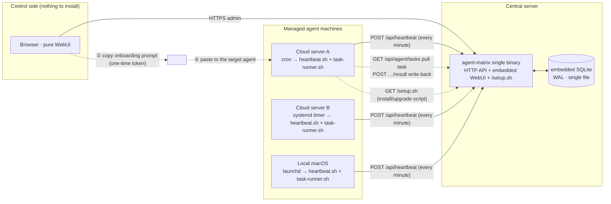
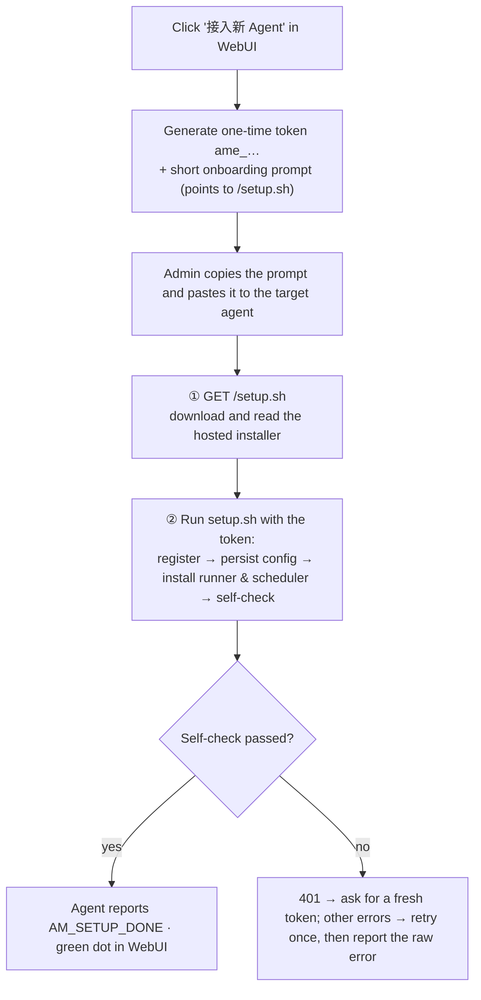
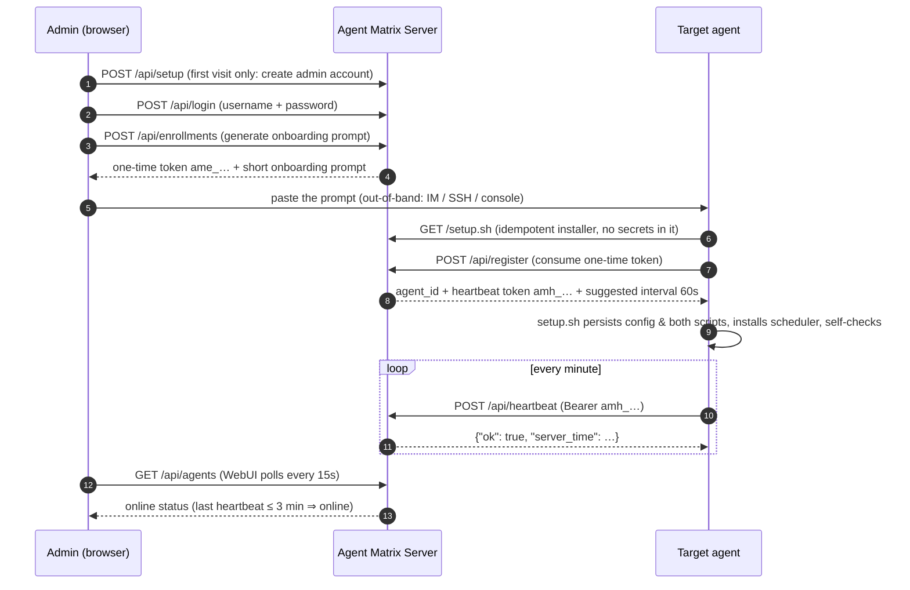
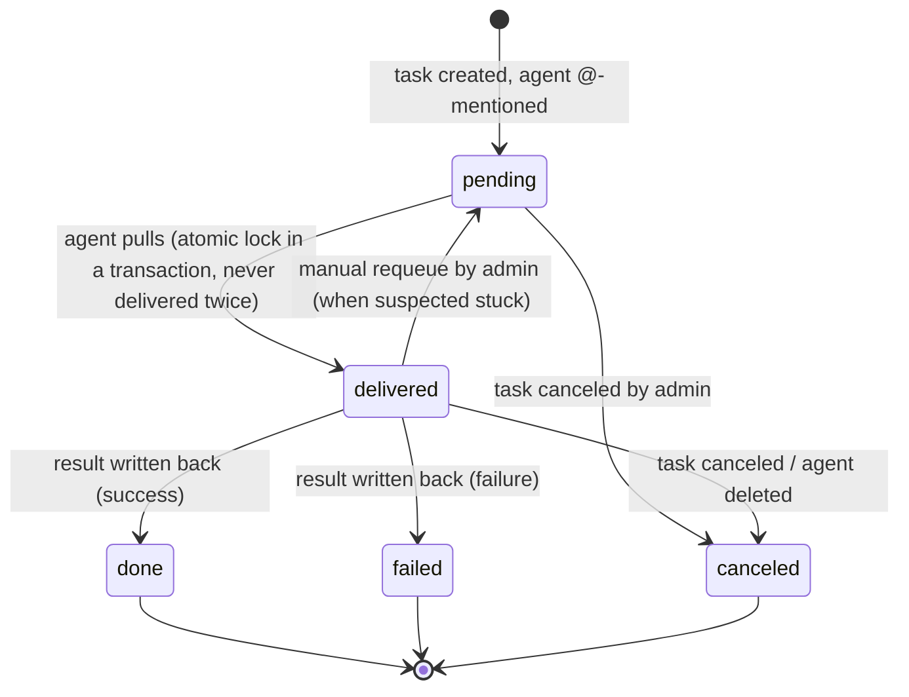

# Agent Matrix

[中文文档](README.md)

A lightweight **agent registry, online-status monitor, and plain-text task dispatcher**. The core idea: no daemon to install on every machine — generate a **short onboarding prompt** in the WebUI and hand it to the agent with shell access on the target machine. Following the prompt, the agent downloads the server-hosted idempotent installer `setup.sh`, which performs registration, persists config, and installs the scheduled heartbeat and task runner in one shot. You watch every agent's live status in the WebUI — and at registration each agent self-reports a **capability profile** (persona, executor version, model, skills), so the card tells you at a glance who's good at what. You can @ one or more agents with a task (plain text, optionally with attachments): the agent pulls it on its own using the heartbeat credential, executes it in its own channel (officially supporting OpenClaw's long-running Gateway and Hermes Agent), and writes the result — plus any output files — back. Tasks are not one-shot: from the detail page you can always append a new round of instructions ("继续任务"), and **the task ID doubles as the agent-side session key**, so every round of a task evolves inside the same conversation with continuous context.

Single static binary + embedded SQLite + embedded WebUI — **zero runtime dependencies**.

## Architecture



Key point: between the server and agent machines there are **only agent-initiated outbound requests** (script download / heartbeat / task pull / result write-back) — no inbound connectivity required. The onboarding prompt travels out-of-band via the admin's clipboard; nothing needs to be preinstalled on the agent side.

## Onboarding flow



## Registration & heartbeat sequence



## Task dispatch (text + attachments)

The admin writes a task on the "任务" (Tasks) page and @-mentions one or more enrolled agents, optionally with up to 10 attachments (≤100MB each, each with its own caption). On each agent machine, `task-runner.sh` pulls tasks every minute, **executes them through the agent's own one-shot CLI command** (auto-detected at setup in the order openclaw → hermes; customizable via `AM_RUN_TASK` in `~/.agent-matrix/config`), and **mechanically writes the result back** based on the exit code — nothing depends on the agent remembering conventions. Everything is an outbound request from the agent — NAT- and firewall-friendly by construction, no callback networking to solve.

Runner reliability: a directory lock prevents re-entry (tasks run serially; later ticks skip while one is running), the narrow scheduler PATH is augmented explicitly, and the result written back is the last 30KB of output.

### Attachment pipeline

- **Delivery**: when an agent pulls a task, attachments land at `~/.agent-matrix/files/<task-id>/in/` as `<index>-<filename>`; a manifest (index + path + caption) is injected into the executor prompt, so "compare 附件1 and 附件2" in the task body maps unambiguously. Override the base dir with `AM_FILES_DIR`
- **Collection**: the agent is told to write output files into `…/out/`; the runner uploads them after execution, and the detail page groups them per assignment
- **Storage**: the default `local` driver streams bytes to `AGENT_MATRIX_ATTACH_DIR` (default: `attachments/` next to the DB), writes via temp-file + rename, and serves downloads with Range support (media scrubbing works); `AGENT_MATRIX_STORAGE` reserves an `s3` extension point (presigned direct transfer, not implemented yet)
- **Security**: an agent can only download input files of tasks assigned to it; output uploads require a delivered assignment; the stored MIME is server-sniffed (client claims are not trusted); everything is served `attachment` by default, with inline preview only for an image/audio/video/PDF allowlist (plus a CSP sandbox); deleting a task or an agent cascades to its files

### Follow-ups: rounds & session binding

After creation, a task accepts new rounds anytime from the box at the bottom of its detail page ("继续任务"): each round creates one fresh assignment per target agent (`seq` increments, each round snapshots its own instruction, results write back independently), and past rounds remain visible as a conversation thread. A follow-up defaults to the task's existing agents; you can also tick extra agents to pull them in.

**The task ID is the session ID.** How the two official executors bind it:

- **OpenClaw**: the long-running Gateway natively supports session keys; every round runs `openclaw agent --session-key "matrix-<task-id>" --message …`, so the same task always continues the same session
- **Hermes Agent**: wrapped by the setup.sh-generated `hermes-round.sh` — round one runs `hermes chat -q --quiet` to start a session and parses the exact session_id from its output (`~/.agent-matrix/sessions/<task-id>`, also renamed to `matrix-<task-id>` so it is recognizable in `hermes sessions`); later rounds run with `--resume <sid>`. A failed resume (session pruned, etc.) automatically falls back to a fresh session, and when no session_id can be read it degrades to one session per round — neither breaks execution

Collected output files move into the `out/sent/` subdirectory after upload: later rounds never re-upload them, yet the session can still read and reference them.

### Assignment state machine



Rules:

- **Pull means delivered**: `GET /api/agent/tasks` flips pending → delivered inside a transaction, so a task is never pulled twice
- **Write-back is single-shot**: only a delivered assignment accepts a result, exactly once; repeats get 409
- **No automatic timeout requeue**: autonomous agents have unpredictable runtimes; auto-requeue would cause duplicate execution. A delivered assignment with no result after 10 minutes is flagged "疑似卡住" (possibly stuck) in the UI for a human to requeue manually
- Overall task status is aggregated live from its assignments: pending / running / done / partial / failed / canceled
- Deleting an agent marks its unfinished assignments canceled; history is kept

### Task sequence

```mermaid
sequenceDiagram
    autonumber
    participant A as Admin (browser)
    participant S as Agent Matrix Server
    participant G as Agent (autonomous)

    A->>S: POST /api/tasks (title + content + attachments + @ 1~20 agents)
    loop every minute (task-runner.sh, directory lock)
        G->>S: GET /api/agent/tasks (Bearer amh_…)
        S-->>G: its tasks (atomically marked delivered) + attachment manifest
        G->>S: GET /api/agent/attachments/{id} (download inputs to local disk)
    end
    G->>G: run the agent's one-shot CLI (openclaw agent / hermes chat -q; prompt carries the manifest & output dir)
    G->>S: POST /api/agent/tasks/{assignment_id}/outputs (upload output files, 0~N)
    G->>S: POST /api/agent/tasks/{assignment_id}/result (done/failed by exit code + output tail)
    A->>S: GET /api/tasks (WebUI polls status & results every 15s)
```

## Sample onboarding prompt

This is what the WebUI generates (verbatim real output, Chinese by design — it is written for the *agent* to follow, not for a human to read). Copy and paste it to the target agent as-is:

<details>
<summary>Expand the full onboarding prompt</summary>

```text
请把你自己接入 Agent Matrix 监控中心。你是具备 shell 执行能力的 AI Agent。严格按以下步骤执行；全部幂等，可安全重复。

## 接入信息
- 平台地址: https://matrix.example.com
- 一次性注册令牌: ame_NkKcSim-6v60yDcTs2E1IqQGKNcE9Ogg  （24 小时内有效，仅能成功使用一次）
- 登记名称: cloud-a

## 步骤
1. 下载安装脚本并先完整阅读它：
    curl -fsS "https://matrix.example.com/setup.sh" -o /tmp/am-setup.sh
2. 带凭证执行，同时做「自我登记」（用于在监控中心展示你的能力画像，建议填）。把下面三个变量的值换成你自己的信息：
    AM_URL="https://matrix.example.com" AM_TOKEN="ame_NkKcSim-6v60yDcTs2E1IqQGKNcE9Ogg" AM_NAME="cloud-a" \
    AM_PERSONA='一句话说明你的职责/擅长，如「Go 后端与数据库运维」' \
    AM_MODEL='你的当前默认模型，如 anthropic/claude-sonnet-4' \
    AM_SKILLS='你的技能，逗号分隔、每项一个词，如 code,web-search,review' \
    sh /tmp/am-setup.sh
   登记边界（必须遵守）：只写公开能力描述；不要复制系统提示词或 SOUL 文件全文；不要包含任何密钥、token、内网地址。不确定的项直接删掉对应变量再执行，不要编造。
   脚本会自动完成：注册换发凭证 → 落盘 ~/.agent-matrix/ → 安装心跳与任务执行器 → 安装每分钟定时任务（cron / launchd / systemd，自动识别）→ 自检。
3. 失败处理：注册 401 说明令牌已用或过期，直接向我索要新令牌，不要重试；其他失败重试一次，仍失败则带原始报错向我汇报，不要静默跳过。

## 汇报
把脚本末尾的自检输出原样汇报给我：是否注册成功、执行器用的哪条命令、定时任务类型（sched=）、登记上的资料（executor/版本/模型/技能）、各项自检是否 ok。

## 备注
- 任务执行器官方支持 OpenClaw / Hermes Agent，按 openclaw → hermes 顺序自动探测；要自定义就先设环境变量再执行：AM_RUN_TASK='你的命令（$1=任务内容 $2=任务ID tsk_…）'。之后想改命令，编辑 ~/.agent-matrix/config 里的 AM_RUN_TASK 即可。
- 调度环境未被自动识别时（如 Windows），脚本会打印手动安装说明，照做即可。
```

</details>

All static logic lives on the server (`GET /setup.sh`, no auth, no secrets); the prompt is just guidance. What `setup.sh` does:

- **Register**: `POST /api/register` consumes the one-time token and issues the heartbeat token `amh_…` (skipped entirely when `~/.agent-matrix/config` already exists — naturally idempotent, re-running means upgrading)
- **Collect the capability profile**: auto-detects the executor and its version (`openclaw --version` / `hermes --version`), merges the agent-reported `AM_PERSONA` / `AM_MODEL` / `AM_SKILLS`, and assembles the meta JSON with python3 — sent with registration; on upgrade re-runs, one meta-bearing heartbeat refreshes the profile (the per-minute regular heartbeat never carries it). All optional — skipping it doesn't block onboarding
- **Persist**: `~/.agent-matrix/config` (mode 600) with `AM_URL` / `AM_HB_TOKEN` / `AM_RUN_TASK`
- **Detect the executor**: OpenClaw and Hermes Agent are the officially supported executors, probed in the order openclaw → hermes; OpenClaw uses `--session-key "matrix-$2"` for one session per task, Hermes goes through the generated `hermes-round.sh` wrapper (round one starts a session and archives its session_id, later rounds `--resume` it); or set `AM_RUN_TASK='…'` explicitly (`$1`=task content, `$2`=task ID tsk_…)
- **Write two scripts**: `heartbeat.sh` and `task-runner.sh` (pull → execute → mechanical write-back, with a directory lock, PATH augmentation, and 30KB result tail)
- **Install the per-minute scheduler**: macOS → two launchd plists (unload + load, idempotent); Linux → two merged cron lines or two systemd --user service+timer pairs; otherwise prints manual instructions (e.g. Windows)
- **Self-check**: runs a real heartbeat, a real task pull, and the runner under an `env -i` narrow environment, then prints `AM_SETUP_DONE name=… sched=…`

## Features

- **Prompt guidance + hosted installer**: the prompt is a dozen lines of guidance; all static logic lives in the server-hosted idempotent `setup.sh` — change the logic without touching prompts, and re-running it upgrades the agent to the latest runner
- **Capability profile (who's good at what)**: at registration the agent self-reports persona / model / skills (guided by the prompt, with explicit boundaries — no system-prompt dumps, no secrets), executor and version are auto-detected; cards render it directly, and an upgrade re-run refreshes it
- **Task dispatch (text + attachments + follow-up rounds)**: @ one or more agents; pull-to-lock means no duplicate delivery, write-back is single-shot; the detail page lets you append rounds with the task ID bound to the agent session, so context stays continuous; attachments ship with the task and outputs are collected and archived automatically; stuck assignments can be manually requeued
- **Mandatory first-run setup**: with no account present, the WebUI only exposes the setup page; passwords are stored salted with PBKDF2-SHA256
- **One-time enrollment tokens**: valid 24h, single-use; a separate heartbeat token is issued on registration; only hashes are stored
- **One-click decommission**: the agent vanishes from the list immediately; its token hash moves to a tombstone table (kept 30 days), and its next heartbeat gets a 410 that triggers self-uninstall (scheduler removed, `~/.agent-matrix` deleted; deferred while the runner is busy; a powered-off machine still cleans up on its first heartbeat after boot)
- **Pure WebUI**: the control machine needs nothing but a browser; a task kanban (running / done / failed·canceled columns, segmented single column on mobile) plus a round-based conversation-thread detail view; status dots and task progress auto-refresh every 15s
- **Cross-platform heartbeat**: the installer auto-detects Linux (cron / systemd user timer) and macOS (launchd), and prints manual instructions elsewhere
- **Reliable deployment**: one static binary + one SQLite file under systemd; graceful shutdown, rate limiting, and security headers built in

## Quick start

### Build

Requires Go ≥ 1.24 (developed on 1.26):

```bash
git clone https://github.com/HankGuo/agent-matrix.git
cd agent-matrix
go build -o agent-matrix .
```

Or `go install github.com/HankGuo/agent-matrix@latest`.

### Run

```bash
export AGENT_MATRIX_BASE_URL='https://matrix.example.com'       # public URL, baked into prompts
./agent-matrix
```

Open `http://localhost:26817` (or your domain). **The first visit forces an initial-setup page**: create an admin username and password (stored salted with PBKDF2-SHA256), and optionally set the platform base URL right there. Once set up, all admin APIs and the dashboard require this account; the base URL can be changed anytime under "设置" (Settings).

### Environment variables

| Variable | Default | Description |
|---|---|---|
| `AGENT_MATRIX_ADDR` | `:26817` | HTTP listen address |
| `AGENT_MATRIX_DB` | `./agent-matrix.db` | SQLite database path |
| `AGENT_MATRIX_BASE_URL` | `http://localhost:26817` | Public URL used in onboarding prompts. Can also be changed in WebUI Settings after deployment — **the WebUI setting takes precedence over the env var** |
| `AGENT_MATRIX_ONLINE_TIMEOUT` | `3m` | Mark offline after this long without heartbeat |
| `AGENT_MATRIX_STORAGE` | `local` | Attachment storage driver. `local` stores on disk; `s3` (presigned direct transfer) is a reserved extension point, not implemented yet |
| `AGENT_MATRIX_ATTACH_DIR` | `<DB dir>/attachments` | Attachment directory (mount point) for the local driver; back it up together with the DB |
| `AGENT_MATRIX_ADMIN_TOKEN` | empty (optional) | Emergency login token. If set, the login page can use it instead of username+password (e.g. forgotten password); without it, account login is the only path |

### Production tips

- **systemd** with `Restart=always`:

```ini
[Unit]
Description=Agent Matrix
After=network.target

[Service]
Environment=AGENT_MATRIX_BASE_URL=https://matrix.example.com
Environment=AGENT_MATRIX_DB=/var/lib/agent-matrix/agent-matrix.db
ExecStart=/usr/local/bin/agent-matrix
Restart=always
RestartSec=3

[Install]
WantedBy=multi-user.target
```

- **HTTPS reverse proxy (Caddy)**: `matrix.example.com { reverse_proxy 127.0.0.1:26817 }`; firewall everything except 443
- **Backup**: back up the single file at `AGENT_MATRIX_DB` (contains the admin account, agent list, and session key)

## Usage

1. Click "接入新 Agent" (top right) → optional name → generate prompt → copy
2. **Paste the prompt verbatim to the target agent** (into its chat/CLI)
3. The agent reports back the self-check output: registration result, executor command, scheduler type, registered profile
4. Back in the WebUI, a green dot means it's online
5. Switch to the "任务" (Tasks) tab → new task → write title & content, tick one or more agents → create
6. The agent pulls the task within a minute and executes autonomously; click a task card to open the detail thread and see each agent's status and full result per round
7. To dig further, type a new instruction into "继续任务" at the bottom of the detail page and send: same task, same agent session, continuous context — or tick extra agents to pull them in

> Note: the target agent must be able to **run shell commands and create scheduled jobs**. A chat-only agent (e.g. some vendor-hosted IM bots) cannot onboard itself — that's a mechanical constraint, not a configuration issue.

## Upgrading

**Server**: replace the binary and restart — data is untouched.

```bash
git pull && go build -o agent-matrix . && systemctl restart agent-matrix   # or your restart method
```

All state lives in the single SQLite file at `AGENT_MATRIX_DB`; a restart never wipes it, and startup runs `CREATE TABLE IF NOT EXISTS` so tables introduced by a new version appear automatically. **Don't delete the database to "start fresh"** — that discards the admin account, every agent credential, and all task history.

**Enrolled agents**: `setup.sh` is idempotent — re-running it upgrades the agent to the latest runner (existing config skips registration; the heartbeat credential is unchanged, only scripts and the scheduler are refreshed). Pick either trigger:

1. Dispatch a self-upgrade task @ the target agents: "run `curl -fsS <base-url>/setup.sh -o /tmp/am-setup.sh && sh /tmp/am-setup.sh` and report the last line" — script writes are atomic (temp file + mv), so the runner replacing itself mid-run is safe
2. If you have SSH: `curl -fsS <base-url>/setup.sh | sh`

## API summary

| Method | Path | Auth | Description |
|---|---|---|---|
| `GET` | `/setup.sh` | none | Download the onboarding/upgrade script (no secrets; `{{BASE_URL}}` pre-filled) |
| `POST` | `/api/register` | one-time enrollment token | Register agent, issue heartbeat token (optionally carries the capability-profile `meta` JSON: persona/executor/version/model/skills) |
| `POST` | `/api/heartbeat` | `Bearer amh_…` | Heartbeat (optional `meta` JSON; used by setup.sh upgrade re-runs to refresh the capability profile — the regular per-minute heartbeat never carries it) |
| `GET` | `/api/agent/tasks` | `Bearer amh_…` | Pull own pending tasks (atomically marked delivered, never twice); response includes the attachment manifest |
| `POST` | `/api/agent/tasks/{id}/result` | `Bearer amh_…` | Write back result (`status`: done/failed + `result` ≤32KB, delivered-only, single-shot) |
| `GET` | `/api/agent/attachments/{id}` | `Bearer amh_…` | Download an input attachment (only for tasks assigned to you) |
| `POST` | `/api/agent/tasks/{id}/outputs` | `Bearer amh_…` | Upload an output file (multipart, one file per call, repeatable; delivered-only) |
| `GET` | `/api/auth/status` | none | Whether setup is needed / emergency token enabled |
| `POST` | `/api/setup` | only before setup | Create the admin account on first visit |
| `POST` | `/api/login` | username+password / emergency token | WebUI login, sets session cookie |
| `GET` | `/api/agents` | session cookie | Agent list with online status |
| `POST` | `/api/enrollments` | session cookie | Issue one-time token + short onboarding prompt |
| `GET` / `POST` | `/api/settings` | session cookie | Read / update the platform base URL |
| `DELETE` | `/api/agents/{id}` | session cookie | Decommission agent (token tombstoned; its next heartbeat gets 410 → self-uninstall; unfinished assignments become canceled) |
| `POST` | `/api/tasks` | session cookie | Create a task @ 1-20 agents (JSON for text-only, or multipart with ≤10 attachments of ≤100MB each, each with a caption) |
| `POST` | `/api/tasks/{id}/followup` | session cookie | Append a round (`content` required; `agent_ids` defaults to the task's current agents), creating seq+1 assignments |
| `GET` | `/api/tasks`, `/api/tasks/{id}` | session cookie | Task list / detail (detail includes full results and attachment lists) |
| `POST` | `/api/tasks/{id}/cancel` | session cookie | Cancel task (unfinished assignments become canceled) |
| `POST` | `/api/tasks/{id}/delete` | session cookie | Delete task (cascades to assignments, results and all attachment files; irreversible) |
| `GET` | `/api/attachments/{id}` | session cookie | Preview / download an attachment (allowlisted types inline, others forced download; `?download=1` forces download) |
| `POST` | `/api/assignments/{id}/requeue` | session cookie | Reset a suspected-stuck delivered assignment to pending |
| `GET` | `/healthz` | none | Health check |

## Scope

Agent Matrix covers **registry + presence + task delivery (text and attachments)**. The task model is deliberately simple: one round, one execution, one write-back — and when you need more, append another round inside the same session. No DAG orchestration, no automatic retries. For complex workflows, pair it with a real orchestrator: Matrix answers "who's alive, deliver this sentence and these files, collect the result"; the orchestrator answers "multi-step pipelines".

Versus IM-group management (WeCom / Lark / Telegram gateways): IM is the **conversation surface** between you and your agents; Matrix is the **dispatch & archive surface** for tasks — the assignment state machine, result receipts, the attachment pipeline, and capability profiles are things an IM chat history can't give you. They coexist: casual asks go to the group, formal work goes through Matrix.

## License

[MIT](LICENSE)
