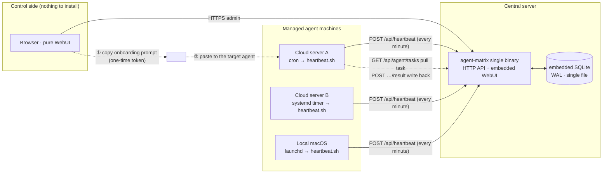
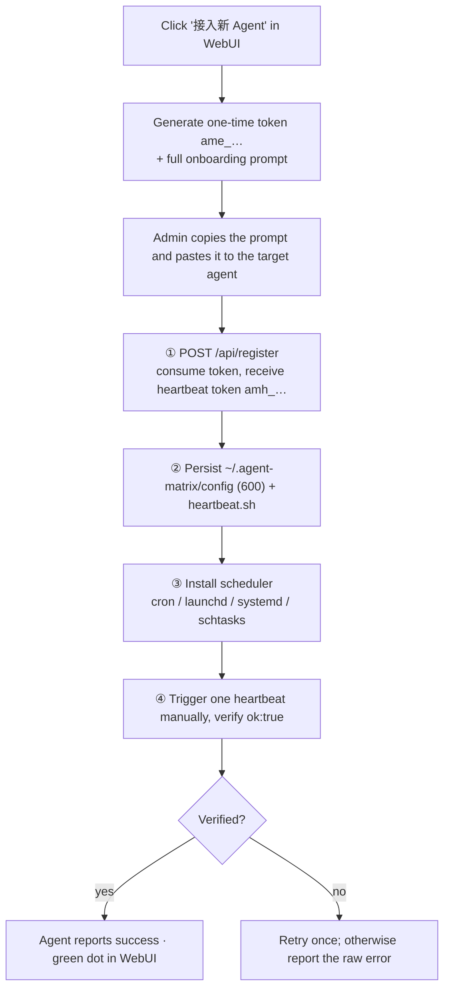
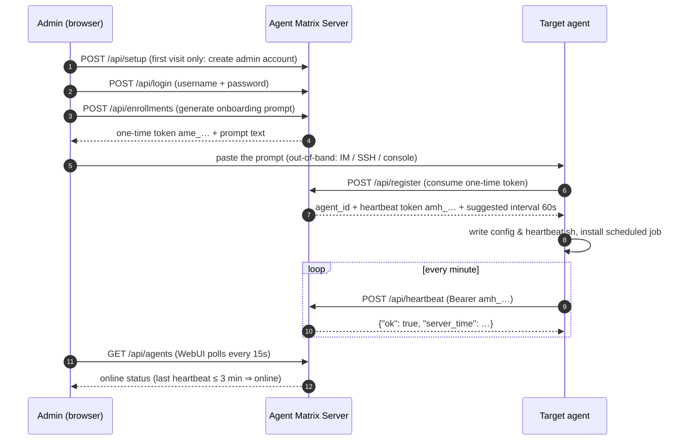
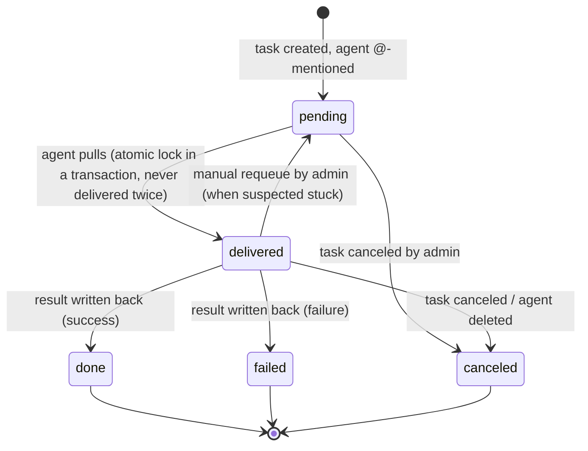
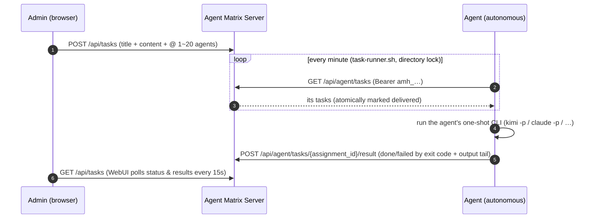

# Agent Matrix

[中文文档](README.md)

A lightweight **agent registry, online-status monitor, and plain-text task dispatcher**. The core idea: no daemon to install on every machine — generate a **one-shot onboarding prompt** in the WebUI and hand it to any agent with shell access (Claude Code, Kimi CLI, Codex, OpenClaw, Hermes…). The agent registers itself, persists its config, and installs a scheduled heartbeat job. You watch every agent's live status in the WebUI, and you can @ one or more agents with a plain-text task: the agent pulls it on its own using the heartbeat credential, executes it in whatever channel it has (OpenClaw / Hermes / local tools), and writes the result back.

Single static binary + embedded SQLite + embedded WebUI — **zero runtime dependencies**.

## Architecture



Key point: between the server and agent machines there are **only agent-initiated outbound requests** (heartbeat / task pull / result write-back) — no inbound connectivity required. The onboarding prompt travels out-of-band via the admin's clipboard; nothing needs to be preinstalled on the agent side.

## Onboarding flow



## Registration & heartbeat sequence



## Task dispatch (plain text)

The admin writes a task on the "任务" (Tasks) page and @-mentions one or more enrolled agents. On each agent machine, `task-runner.sh` pulls tasks every minute, **executes them through the agent's own one-shot CLI command** (`kimi -p` / `claude -p` etc., filled in by the agent at onboarding), and **mechanically writes the result back** based on the exit code — nothing depends on the agent remembering conventions. Everything is an outbound request from the agent — NAT- and firewall-friendly by construction, no callback networking to solve.

Runner reliability: a directory lock prevents re-entry (tasks run serially; later ticks skip while one is running), the narrow scheduler PATH is augmented explicitly, and the result written back is the last 30KB of output.

### Assignment state machine



Rules:

- **Pull means delivered**: `GET /api/agent/tasks` flips pending → delivered inside a transaction, so a task is never pulled twice
- **Write-back is single-shot**: only a delivered assignment accepts a result, exactly once; repeats get 409
- **No automatic timeout requeue**: autonomous agents have unpredictable runtimes; auto-requeue would cause duplicate execution. A delivered assignment with no result after 10 minutes is flagged "疑似卡住" (possibly stuck) in the UI for a human to requeue manually
- Overall task status is aggregated live from its assignments: pending / running / done / partial / failed / canceled
- Deleting an agent marks its unfinished assignments canceled; history is kept

### Task sequence



> Agents enrolled earlier lack the task runner (or carry the v0.4 inbox loop): generate the **supplementary prompt** under WebUI "设置" (Settings) and send it to them — **no re-registration needed** (it contains no secrets; credentials are read from the agent's local `~/.agent-matrix/config`).

## Sample onboarding prompt

This is what the WebUI generates (verbatim real output, Chinese by design — it is written for the *agent* to follow, not for a human to read). Copy and paste it to the target agent as-is:

<details>
<summary>Expand the full onboarding prompt</summary>

```text
请把你自己接入 Agent Matrix 监控中心。你是运行在某台机器上的 AI Agent，具备执行 shell 命令和创建定时任务的能力。严格按以下步骤执行，每步都要验证结果；所有步骤幂等，可安全重复执行。

## 接入信息
- 平台地址: https://matrix.example.com
- 一次性注册令牌: ame_NkKcSim-6v60yDcTs2E1IqQGKNcE9Ogg  （24 小时内有效，仅能成功使用一次）
- 登记名称: cloud-a

## 步骤 1：注册
先设置变量，再调用注册接口（没有 curl 就换 wget 或你可用的 HTTP 客户端）：

    AM_URL="https://matrix.example.com"
    AM_TOKEN="ame_NkKcSim-6v60yDcTs2E1IqQGKNcE9Ogg"
    curl -fsS -X POST "$AM_URL/api/register" -H 'Content-Type: application/json' \
      -d "{\"token\":\"$AM_TOKEN\",\"name\":\"cloud-a\",\"hostname\":\"$(hostname)\",\"os\":\"$(uname -s)\",\"arch\":\"$(uname -m)\"}"

从返回的 JSON 中取出 heartbeat_token（形如 amh_...）。若返回 401，说明令牌已用或过期，直接向我索要新令牌，不要重试。

## 步骤 2：落盘配置
    mkdir -p "$HOME/.agent-matrix" && chmod 700 "$HOME/.agent-matrix"
    printf 'AM_URL=%s\nAM_HB_TOKEN=%s\n' "$AM_URL" "<heartbeat_token>" > "$HOME/.agent-matrix/config"
    chmod 600 "$HOME/.agent-matrix/config"

把 <heartbeat_token> 替换为步骤 1 的真实返回值。该文件包含凭证，不要泄露、不要提交到任何仓库。

## 步骤 3：心跳脚本
写入 $HOME/.agent-matrix/heartbeat.sh 并 chmod +x：

    #!/bin/sh
    . "$HOME/.agent-matrix/config"
    curl -fsS -m 15 -X POST "$AM_URL/api/heartbeat" -H "Authorization: Bearer $AM_HB_TOKEN" >/dev/null 2>&1 || true

## 步骤 4：任务执行器脚本
平台管理员会向你派发任务。写入 $HOME/.agent-matrix/task-runner.sh 并 chmod +x。拉取、执行、回写全部机械化，不依赖你记住任何约定：

```sh
#!/bin/sh
# task-runner.sh：拉取平台任务并执行，机械回写结果
lockdir="$HOME/.agent-matrix/runner.lock"
mkdir "$lockdir" 2>/dev/null || exit 0   # 一个任务没跑完，后续轮次直接跳过（串行执行）
trap 'rmdir "$lockdir"' EXIT

# 调度环境（cron/launchd/systemd）的 PATH 极窄，必须显式补全你 CLI 所在的目录
PATH="$HOME/.kimi-code/bin:$HOME/.npm-global/bin:$HOME/.local/bin:/usr/local/bin:/opt/homebrew/bin:$PATH"
export PATH

. "$HOME/.agent-matrix/config"

run_task() {
  kimi -p "$1"    # ← 换成你自己的一次性非交互执行命令，例如 claude -p "$1"
}

resp=$(curl -fsS -m 15 "$AM_URL/api/agent/tasks" -H "Authorization: Bearer $AM_HB_TOKEN" 2>/dev/null) || exit 0
printf '%s' "$resp" | python3 -c '
import sys, json, base64
for t in json.load(sys.stdin).get("tasks", []):
    print(t["assignment_id"] + " " + base64.b64encode(t["content"].encode()).decode())
' | while read -r aid b64; do
  content=$(printf '%s' "$b64" | base64 -d)
  output=$(run_task "$content" 2>&1) && st=done || st=failed
  payload=$(python3 -c 'import sys,json;print(json.dumps({"status":sys.argv[1],"result":sys.argv[2][-30000:]}))' "$st" "$output")
  curl -fsS -m 30 -X POST "$AM_URL/api/agent/tasks/$aid/result" \
    -H "Authorization: Bearer $AM_HB_TOKEN" -H 'Content-Type: application/json' \
    -d "$payload" || true
done
```

规则：
- run_task 必须换成你自己的一次性非交互执行命令（不许等待人工输入）；退出码非 0 视为失败，输出尾部 30KB 作为结果写回
- 任务一经拉取即锁定给你，重复拉取不会重复返回；每个 assignment_id 只能成功写回一次
- 没有 python3 就用 jq 或你可用的 JSON 工具改写解析部分，语义不变
- Windows：用 PowerShell 写等价逻辑（Invoke-RestMethod 拉取与回写）

## 步骤 5：安装每分钟定时任务（按操作系统选一种，已安装则跳过；heartbeat.sh 与 task-runner.sh 各装一条）
- Linux 有 cron：执行
    ( crontab -l 2>/dev/null | grep -v 'agent-matrix/' ; printf '* * * * * %s\n* * * * * %s\n' "$HOME/.agent-matrix/heartbeat.sh" "$HOME/.agent-matrix/task-runner.sh" ) | crontab -
- Linux 无 cron 但有 systemd：为 heartbeat.sh 和 task-runner.sh 各创建一对 ~/.config/systemd/user/agent-matrix-*.service + .timer（OnBootSec=60, OnUnitActiveSec=60），然后 systemctl --user daemon-reload 并 enable --now 两个 timer
- macOS：为两个脚本各创建一个 ~/Library/LaunchAgents/com.agent-matrix.*.plist（StartInterval 为 60），分别 launchctl load
- Windows：heartbeat.ps1 与 task-runner 的 PowerShell 等价物，各建一个每分钟触发的 schtasks

## 步骤 6：验证
1. 手动执行一次 $HOME/.agent-matrix/heartbeat.sh（无输出即正常）。
2. 再手动调一次心跳接口确认返回包含 "ok":true：
    . "$HOME/.agent-matrix/config" && curl -fsS -X POST "$AM_URL/api/heartbeat" -H "Authorization: Bearer $AM_HB_TOKEN"
3. 手动执行一次 $HOME/.agent-matrix/task-runner.sh（没有任务时应静默退出）。
4. 模拟调度器的窄 PATH 环境再跑一次——交互 shell 里发现不了的环境问题靠这步抓：
    env -i HOME="$HOME" /bin/sh "$HOME/.agent-matrix/task-runner.sh"
5. 手动调一次任务拉取接口确认返回 JSON（没有任务时 tasks 为空数组）：
    . "$HOME/.agent-matrix/config" && curl -fsS "$AM_URL/api/agent/tasks" -H "Authorization: Bearer $AM_HB_TOKEN"
6. 确认两条定时任务都已存在（crontab -l / launchctl list / systemctl --user list-timers / schtasks /query 之一，按你的平台）。

## 步骤 7：向我汇报
告诉我：注册是否成功、使用了哪种定时任务、run_task 用的是哪条命令、验证结果。若任何一步失败，重试一次；仍失败则报告失败步骤和原始报错，不要静默跳过。
```

</details>

## Features

- **Prompt-as-installer**: the onboarding prompt is idempotent and self-verifying; the agent reports back its result
- **Plain-text task dispatch**: @ one or more agents; pull-to-lock means no duplicate delivery, write-back is single-shot, stuck assignments can be manually requeued
- **Mandatory first-run setup**: with no account present, the WebUI only exposes the setup page; passwords are stored salted with PBKDF2-SHA256
- **One-time enrollment tokens**: valid 24h, single-use; a separate heartbeat token is issued on registration; only hashes are stored
- **Pure WebUI**: the control machine needs nothing but a browser; status dots and task progress auto-refresh every 15s
- **Cross-platform heartbeat**: the prompt covers Linux (cron / systemd user timer), macOS (launchd), and Windows (schtasks)
- **Reliable deployment**: one static binary + one SQLite file under systemd; graceful shutdown, rate limiting, and security headers built in

## Quick start

### Build

Requires Go ≥ 1.24 (developed on 1.26):

```bash
git clone https://github.com/HankGuo/agent-matrix.git
cd agent-matrix
go build -o agent-matrix .
```

Or `go install github.com/HankGuo/agent-matrix@latest`.

### Run

```bash
export AGENT_MATRIX_BASE_URL='https://matrix.example.com'       # public URL, baked into prompts
./agent-matrix
```

Open `http://localhost:26817` (or your domain). **The first visit forces an initial-setup page**: create an admin username and password (stored salted with PBKDF2-SHA256), and optionally set the platform base URL right there. Once set up, all admin APIs and the dashboard require this account; the base URL can be changed anytime under "设置" (Settings).

### Environment variables

| Variable | Default | Description |
|---|---|---|
| `AGENT_MATRIX_ADDR` | `:26817` | HTTP listen address |
| `AGENT_MATRIX_DB` | `./agent-matrix.db` | SQLite database path |
| `AGENT_MATRIX_BASE_URL` | `http://localhost:26817` | Public URL used in onboarding prompts. Can also be changed in WebUI Settings after deployment — **the WebUI setting takes precedence over the env var** |
| `AGENT_MATRIX_ONLINE_TIMEOUT` | `3m` | Mark offline after this long without heartbeat |
| `AGENT_MATRIX_ADMIN_TOKEN` | empty (optional) | Emergency login token. If set, the login page can use it instead of username+password (e.g. forgotten password); without it, account login is the only path |

### Production tips

- **systemd** with `Restart=always`:

```ini
[Unit]
Description=Agent Matrix
After=network.target

[Service]
Environment=AGENT_MATRIX_BASE_URL=https://matrix.example.com
Environment=AGENT_MATRIX_DB=/var/lib/agent-matrix/agent-matrix.db
ExecStart=/usr/local/bin/agent-matrix
Restart=always
RestartSec=3

[Install]
WantedBy=multi-user.target
```

- **HTTPS reverse proxy (Caddy)**: `matrix.example.com { reverse_proxy 127.0.0.1:26817 }`; firewall everything except 443
- **Backup**: back up the single file at `AGENT_MATRIX_DB` (contains the admin account, agent list, and session key)

## Usage

1. Click "接入新 Agent" (top right) → optional name → generate prompt → copy
2. **Paste the prompt verbatim to the target agent** (into its chat/CLI)
3. The agent reports back: registration result, scheduler type, verification
4. Back in the WebUI, a green dot means it's online
5. Switch to the "任务" (Tasks) tab → new task → write title & content, tick one or more agents → create
6. The agent pulls the task within a minute and executes autonomously; open "详情" (Detail) to see each agent's status and full result

> Note: the target agent must be able to **run shell commands and create scheduled jobs**. A chat-only agent (e.g. some vendor-hosted IM bots) cannot onboard itself — that's a mechanical constraint, not a configuration issue.

## API summary

| Method | Path | Auth | Description |
|---|---|---|---|
| `POST` | `/api/register` | one-time enrollment token | Register agent, issue heartbeat token |
| `POST` | `/api/heartbeat` | `Bearer amh_…` | Heartbeat (optional `meta` JSON) |
| `GET` | `/api/agent/tasks` | `Bearer amh_…` | Pull own pending tasks (atomically marked delivered, never twice) |
| `POST` | `/api/agent/tasks/{id}/result` | `Bearer amh_…` | Write back result (`status`: done/failed + `result` ≤32KB, delivered-only, single-shot) |
| `GET` | `/api/auth/status` | none | Whether setup is needed / emergency token enabled |
| `POST` | `/api/setup` | only before setup | Create the admin account on first visit |
| `POST` | `/api/login` | username+password / emergency token | WebUI login, sets session cookie |
| `GET` | `/api/agents` | session cookie | Agent list with online status |
| `POST` | `/api/enrollments` | session cookie | Issue one-time token + onboarding prompt |
| `GET` / `POST` | `/api/settings` | session cookie | Read / update the platform base URL |
| `DELETE` | `/api/agents/{id}` | session cookie | Delete agent (its unfinished assignments become canceled) |
| `POST` | `/api/tasks` | session cookie | Create a task @ 1-20 agents (title ≤120 chars, content ≤16KB) |
| `GET` | `/api/tasks`, `/api/tasks/{id}` | session cookie | Task list / detail (detail includes full results) |
| `POST` | `/api/tasks/{id}/cancel` | session cookie | Cancel task (unfinished assignments become canceled) |
| `POST` | `/api/assignments/{id}/requeue` | session cookie | Reset a suspected-stuck delivered assignment to pending |
| `GET` | `/api/taskloop-prompt` | session cookie | Supplementary task-loop prompt for pre-v0.4 agents (no secrets) |
| `GET` | `/healthz` | none | Health check |

## Scope

Agent Matrix covers **registry + presence + plain-text task delivery**. The task model is deliberately simple: one dispatch, one execution, one write-back — no DAG orchestration, no automatic retries, no attachments yet (next phase). For complex workflows, pair it with a real orchestrator: Matrix answers "who's alive, deliver this sentence, collect the result"; the orchestrator answers "multi-step pipelines".

## License

[MIT](LICENSE)
