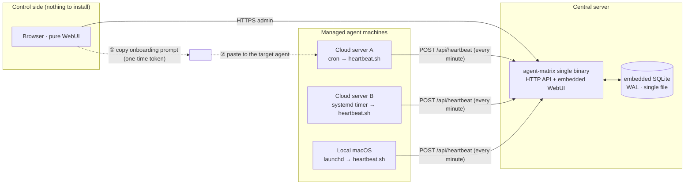
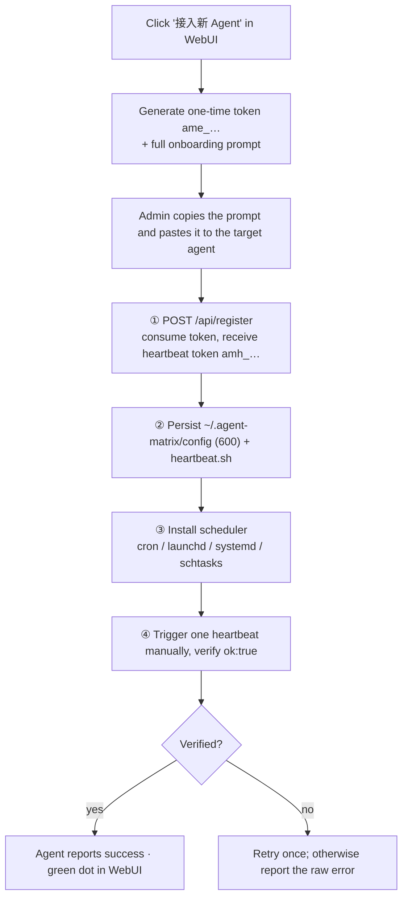
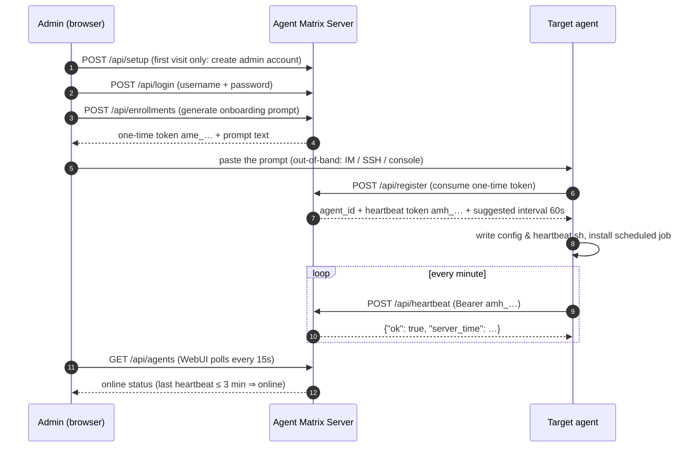

# Agent Matrix

[中文文档](README.md)

A lightweight **agent registry & online-status monitor**. The core idea: no daemon to install on every machine — generate a **one-shot onboarding prompt** in the WebUI and hand it to any agent with shell access (Claude Code, Kimi CLI, Codex, OpenClaw, Hermes…). The agent registers itself, persists its config, and installs a scheduled heartbeat job. You watch every agent's live status in the WebUI.

Single static binary + embedded SQLite + embedded WebUI — **zero runtime dependencies**.

## Architecture



Key point: between the server and agent machines there is **only the agent-initiated outbound heartbeat** — no inbound connectivity required. The onboarding prompt travels out-of-band via the admin's clipboard; nothing needs to be preinstalled on the agent side.

## Onboarding flow



## Registration & heartbeat sequence



## Sample onboarding prompt

This is what the WebUI generates (verbatim real output, Chinese by design — it is written for the *agent* to follow, not for a human to read). Copy and paste it to the target agent as-is:

<details>
<summary>Expand the full onboarding prompt</summary>

```text
请把你自己接入 Agent Matrix 监控中心。你是运行在某台机器上的 AI Agent，具备执行 shell 命令和创建定时任务的能力。严格按以下步骤执行，每步都要验证结果；所有步骤幂等，可安全重复执行。

## 接入信息
- 平台地址: https://matrix.example.com
- 一次性注册令牌: ame_NkKcSim-6v60yDcTs2E1IqQGKNcE9Ogg  （24 小时内有效，仅能成功使用一次）
- 登记名称: cloud-a

## 步骤 1：注册
先设置变量，再调用注册接口（没有 curl 就换 wget 或你可用的 HTTP 客户端）：

    AM_URL="https://matrix.example.com"
    AM_TOKEN="ame_NkKcSim-6v60yDcTs2E1IqQGKNcE9Ogg"
    curl -fsS -X POST "$AM_URL/api/register" -H 'Content-Type: application/json' \
      -d "{\"token\":\"$AM_TOKEN\",\"name\":\"cloud-a\",\"hostname\":\"$(hostname)\",\"os\":\"$(uname -s)\",\"arch\":\"$(uname -m)\"}"

从返回的 JSON 中取出 heartbeat_token（形如 amh_...）。若返回 401，说明令牌已用或过期，直接向我索要新令牌，不要重试。

## 步骤 2：落盘配置
    mkdir -p "$HOME/.agent-matrix" && chmod 700 "$HOME/.agent-matrix"
    printf 'AM_URL=%s\nAM_HB_TOKEN=%s\n' "$AM_URL" "<heartbeat_token>" > "$HOME/.agent-matrix/config"
    chmod 600 "$HOME/.agent-matrix/config"

把 <heartbeat_token> 替换为步骤 1 的真实返回值。该文件包含凭证，不要泄露、不要提交到任何仓库。

## 步骤 3：心跳脚本
写入 $HOME/.agent-matrix/heartbeat.sh 并 chmod +x：

    #!/bin/sh
    . "$HOME/.agent-matrix/config"
    curl -fsS -m 15 -X POST "$AM_URL/api/heartbeat" -H "Authorization: Bearer $AM_HB_TOKEN" >/dev/null 2>&1 || true

## 步骤 4：安装每分钟定时任务（按操作系统选一种，已安装则跳过）
- Linux 有 cron：执行
    ( crontab -l 2>/dev/null | grep -v 'agent-matrix/heartbeat' ; echo "* * * * * $HOME/.agent-matrix/heartbeat.sh" ) | crontab -
- Linux 无 cron 但有 systemd：创建 ~/.config/systemd/user/agent-matrix-heartbeat.service（ExecStart 指向上面的脚本）和同名 .timer（OnBootSec=60, OnUnitActiveSec=60），然后 systemctl --user daemon-reload && systemctl --user enable --now agent-matrix-heartbeat.timer
- macOS：创建 ~/Library/LaunchAgents/com.agent-matrix.heartbeat.plist（ProgramArguments 指向脚本，StartInterval 为 60），然后 launchctl load 该 plist
- Windows：写 heartbeat.ps1（用 Invoke-RestMethod 做同样的 POST），再 schtasks /create /tn "AgentMatrixHeartbeat" /sc minute /mo 1 /tr 指向它

## 步骤 5：验证
1. 手动执行一次 $HOME/.agent-matrix/heartbeat.sh（无输出即正常）。
2. 再手动调一次心跳接口确认返回包含 "ok":true：
    . "$HOME/.agent-matrix/config" && curl -fsS -X POST "$AM_URL/api/heartbeat" -H "Authorization: Bearer $AM_HB_TOKEN"
3. 确认定时任务已存在（crontab -l / launchctl list / systemctl --user list-timers / schtasks /query 之一，按你的平台）。

## 步骤 6：向我汇报
告诉我：注册是否成功、使用了哪种定时任务、验证结果。若任何一步失败，重试一次；仍失败则报告失败步骤和原始报错，不要静默跳过。
```

</details>

## Features

- **Prompt-as-installer**: the onboarding prompt is idempotent and self-verifying; the agent reports back its result
- **Mandatory first-run setup**: with no account present, the WebUI only exposes the setup page; passwords are stored salted with PBKDF2-SHA256
- **One-time enrollment tokens**: valid 24h, single-use; a separate heartbeat token is issued on registration; only hashes are stored
- **Pure WebUI**: the control machine needs nothing but a browser; status dots auto-refresh every 15s
- **Cross-platform heartbeat**: the prompt covers Linux (cron / systemd user timer), macOS (launchd), and Windows (schtasks)
- **Reliable deployment**: one static binary + one SQLite file under systemd; graceful shutdown, rate limiting, and security headers built in

## Quick start

### Build

Requires Go ≥ 1.24 (developed on 1.26):

```bash
git clone https://github.com/HankGuo/agent-matrix.git
cd agent-matrix
go build -o agent-matrix .
```

Or `go install github.com/HankGuo/agent-matrix@latest`.

### Run

```bash
export AGENT_MATRIX_BASE_URL='https://matrix.example.com'       # public URL, baked into prompts
./agent-matrix
```

Open `http://localhost:26817` (or your domain). **The first visit forces an initial-setup page**: create an admin username and password (stored salted with PBKDF2-SHA256), and optionally set the platform base URL right there. Once set up, all admin APIs and the dashboard require this account; the base URL can be changed anytime under "设置" (Settings).

### Environment variables

| Variable | Default | Description |
|---|---|---|
| `AGENT_MATRIX_ADDR` | `:26817` | HTTP listen address |
| `AGENT_MATRIX_DB` | `./agent-matrix.db` | SQLite database path |
| `AGENT_MATRIX_BASE_URL` | `http://localhost:26817` | Public URL used in onboarding prompts. Can also be changed in WebUI Settings after deployment — **the WebUI setting takes precedence over the env var** |
| `AGENT_MATRIX_ONLINE_TIMEOUT` | `3m` | Mark offline after this long without heartbeat |
| `AGENT_MATRIX_ADMIN_TOKEN` | empty (optional) | Emergency login token. If set, the login page can use it instead of username+password (e.g. forgotten password); without it, account login is the only path |

### Production tips

- **systemd** with `Restart=always`:

```ini
[Unit]
Description=Agent Matrix
After=network.target

[Service]
Environment=AGENT_MATRIX_BASE_URL=https://matrix.example.com
Environment=AGENT_MATRIX_DB=/var/lib/agent-matrix/agent-matrix.db
ExecStart=/usr/local/bin/agent-matrix
Restart=always
RestartSec=3

[Install]
WantedBy=multi-user.target
```

- **HTTPS reverse proxy (Caddy)**: `matrix.example.com { reverse_proxy 127.0.0.1:26817 }`; firewall everything except 443
- **Backup**: back up the single file at `AGENT_MATRIX_DB` (contains the admin account, agent list, and session key)

## Usage

1. Click "接入新 Agent" (top right) → optional name → generate prompt → copy
2. **Paste the prompt verbatim to the target agent** (into its chat/CLI)
3. The agent reports back: registration result, scheduler type, verification
4. Back in the WebUI, a green dot means it's online

> Note: the target agent must be able to **run shell commands and create scheduled jobs**. A chat-only agent (e.g. some vendor-hosted IM bots) cannot onboard itself — that's a mechanical constraint, not a configuration issue.

## API summary

| Method | Path | Auth | Description |
|---|---|---|---|
| `POST` | `/api/register` | one-time enrollment token | Register agent, issue heartbeat token |
| `POST` | `/api/heartbeat` | `Bearer amh_…` | Heartbeat (optional `meta` JSON) |
| `GET` | `/api/auth/status` | none | Whether setup is needed / emergency token enabled |
| `POST` | `/api/setup` | only before setup | Create the admin account on first visit |
| `POST` | `/api/login` | username+password / emergency token | WebUI login, sets session cookie |
| `GET` | `/api/agents` | session cookie | Agent list with online status |
| `POST` | `/api/enrollments` | session cookie | Issue one-time token + onboarding prompt |
| `GET` / `POST` | `/api/settings` | session cookie | Read / update the platform base URL |
| `DELETE` | `/api/agents/{id}` | session cookie | Delete agent |
| `GET` | `/healthz` | none | Health check |

## Scope

Agent Matrix is a **registry + presence monitor only** — no task dispatch. It complements task-orchestration platforms (e.g. Multica): Matrix answers "who's alive", an orchestrator answers "who's doing what".

## License

[MIT](LICENSE)
