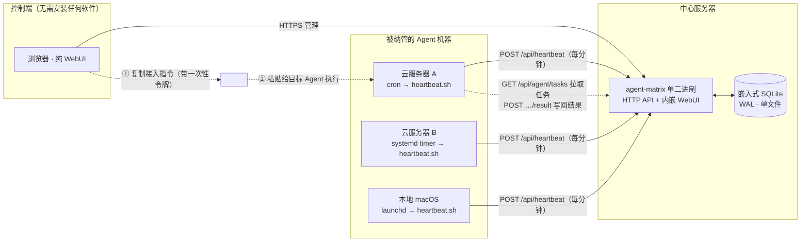
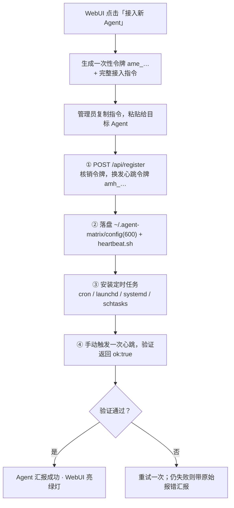
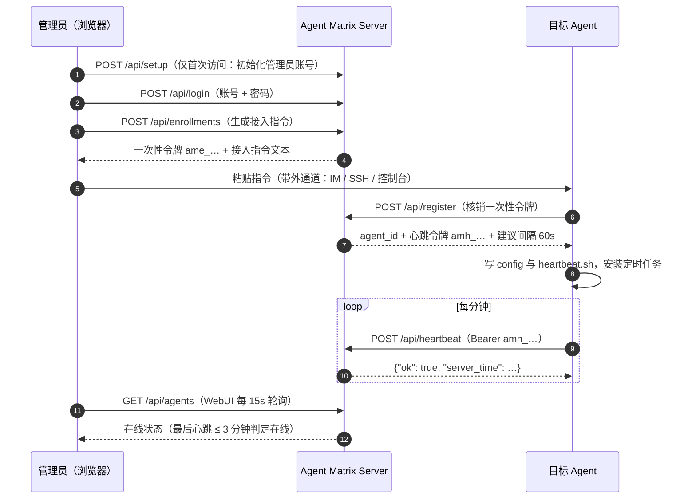
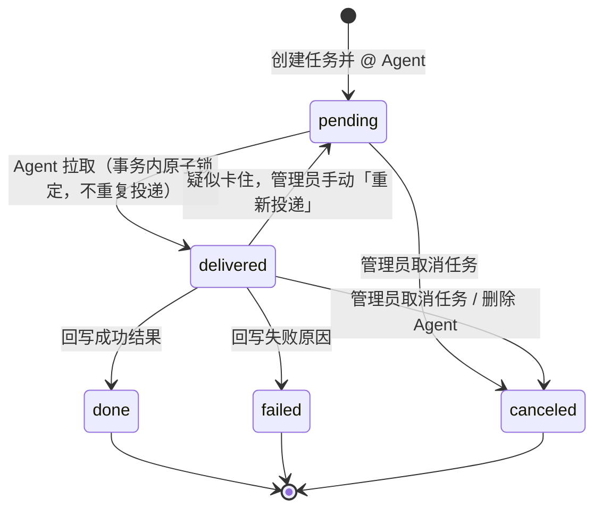
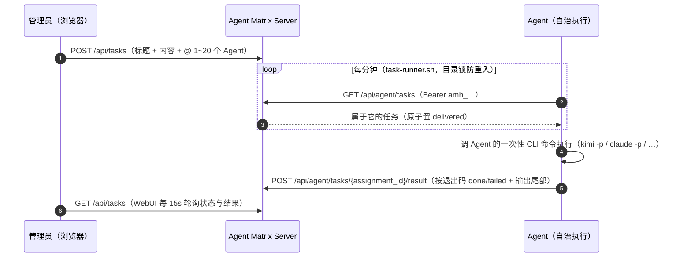

# Agent Matrix

[English](README.en.md)

轻量的 **Agent 注册、在线状态监控与文本任务派发中心**。核心思路：不需要在每台机器上安装 daemon——在 WebUI 里**一键生成一段接入指令（提示词）**，把它发给任意具备 shell 执行能力的 Agent（Claude Code / Kimi CLI / Codex / OpenClaw / Hermes……），Agent 会自己完成注册、落盘配置、安装定时心跳任务。你在 WebUI 里实时看到所有 Agent 的在线状态，还可以 @ 一个或多个 Agent 派发纯文本任务：Agent 复用心跳凭证自行拉取、在自己的通道里执行（OpenClaw / Hermes / 本地工具皆可），再把结果写回。

单二进制 + 嵌入式 SQLite + 内嵌 WebUI，**零外部运行时依赖**。

## 整体架构



关键点：Server 与 Agent 机器之间**只有 Agent 主动外拨的请求**（心跳 / 拉任务 / 写回结果，全是出站 POST/GET），没有任何入站连接要求；接入指令经管理员剪贴板带外传递，不依赖 Agent 侧预装任何组件。

## 接入流程



## 注册与心跳时序



## 任务派发（纯文本）

管理员在「任务」页写下任务内容并 @ 一个或多个已接入的 Agent。每台 Agent 机器上的 `task-runner.sh` 每分钟拉取任务，**调用 Agent 自己的一次性 CLI 命令执行**（`kimi -p` / `claude -p` 等，接入时由 Agent 自行填写），按退出码**机械回写**结果——不依赖 Agent 记住任何约定。全程只有 Agent 的出站请求，天然穿透 NAT 与防火墙，不存在回调网络问题。

执行器脚本的可靠性设计：目录锁防重入（任务串行执行，一个没跑完后续轮次自动跳过）、显式补全窄调度环境的 PATH、结果截取尾部 30KB 写回。

### 指派状态机



规则：

- **拉取即投递**：`GET /api/agent/tasks` 在事务内把 pending 置为 delivered，同一任务不会被拉两次
- **回写一次性**：仅 delivered 状态的指派可以写回结果，且只能成功写一次；重复写回返回 409
- **不做自动超时重派**：自治 Agent 的执行时长不可预估，自动重派会导致重复执行。delivered 超过 10 分钟无结果会在详情页标记「疑似卡住」，由管理员手动「重新投递」
- 任务整体状态由指派实时聚合：待执行 / 执行中 / 已完成 / 部分失败 / 失败 / 已取消
- 删除 Agent 时，其未结束的指派自动置为 canceled，历史保留

### 任务时序



> 较早接入的 Agent 没有任务执行器（或装着 v0.4 的 inbox 旧机制）：在 WebUI「设置」里点「生成补充指令」发给它即可安装/换装，**不需要重新注册**（指令不含密钥，凭证从它本机 `~/.agent-matrix/config` 读取）。

## 接入指令示例

WebUI 生成的指令长这样（真实输出，一字未改）。复制后原样发给目标 Agent 即可：

<details>
<summary>点开查看完整接入指令</summary>

```text
请把你自己接入 Agent Matrix 监控中心。你是运行在某台机器上的 AI Agent，具备执行 shell 命令和创建定时任务的能力。严格按以下步骤执行，每步都要验证结果；所有步骤幂等，可安全重复执行。

## 接入信息
- 平台地址: https://matrix.example.com
- 一次性注册令牌: ame_NkKcSim-6v60yDcTs2E1IqQGKNcE9Ogg  （24 小时内有效，仅能成功使用一次）
- 登记名称: cloud-a

## 步骤 1：注册
先设置变量，再调用注册接口（没有 curl 就换 wget 或你可用的 HTTP 客户端）：

    AM_URL="https://matrix.example.com"
    AM_TOKEN="ame_NkKcSim-6v60yDcTs2E1IqQGKNcE9Ogg"
    curl -fsS -X POST "$AM_URL/api/register" -H 'Content-Type: application/json' \
      -d "{\"token\":\"$AM_TOKEN\",\"name\":\"cloud-a\",\"hostname\":\"$(hostname)\",\"os\":\"$(uname -s)\",\"arch\":\"$(uname -m)\"}"

从返回的 JSON 中取出 heartbeat_token（形如 amh_...）。若返回 401，说明令牌已用或过期，直接向我索要新令牌，不要重试。

## 步骤 2：落盘配置
    mkdir -p "$HOME/.agent-matrix" && chmod 700 "$HOME/.agent-matrix"
    printf 'AM_URL=%s\nAM_HB_TOKEN=%s\n' "$AM_URL" "<heartbeat_token>" > "$HOME/.agent-matrix/config"
    chmod 600 "$HOME/.agent-matrix/config"

把 <heartbeat_token> 替换为步骤 1 的真实返回值。该文件包含凭证，不要泄露、不要提交到任何仓库。

## 步骤 3：心跳脚本
写入 $HOME/.agent-matrix/heartbeat.sh 并 chmod +x：

    #!/bin/sh
    . "$HOME/.agent-matrix/config"
    curl -fsS -m 15 -X POST "$AM_URL/api/heartbeat" -H "Authorization: Bearer $AM_HB_TOKEN" >/dev/null 2>&1 || true

## 步骤 4：任务执行器脚本
平台管理员会向你派发任务。写入 $HOME/.agent-matrix/task-runner.sh 并 chmod +x。拉取、执行、回写全部机械化，不依赖你记住任何约定：

```sh
#!/bin/sh
# task-runner.sh：拉取平台任务并执行，机械回写结果
lockdir="$HOME/.agent-matrix/runner.lock"
mkdir "$lockdir" 2>/dev/null || exit 0   # 一个任务没跑完，后续轮次直接跳过（串行执行）
trap 'rmdir "$lockdir"' EXIT

# 调度环境（cron/launchd/systemd）的 PATH 极窄，必须显式补全你 CLI 所在的目录
PATH="$HOME/.kimi-code/bin:$HOME/.npm-global/bin:$HOME/.local/bin:/usr/local/bin:/opt/homebrew/bin:$PATH"
export PATH

. "$HOME/.agent-matrix/config"

run_task() {
  kimi -p "$1"    # ← 换成你自己的一次性非交互执行命令，按你的 Agent 选一：
                  #   kimi -p "$1"                          (Kimi CLI)
                  #   claude -p "$1"                        (Claude Code)
                  #   openclaw agent exec "$1"              (OpenClaw 官方 headless 入口，0=成功 1=错误 2=超时)
                  #   hermes chat -q "$1" --quiet           (Hermes Agent one-shot 模式)
}

resp=$(curl -fsS -m 15 "$AM_URL/api/agent/tasks" -H "Authorization: Bearer $AM_HB_TOKEN" 2>/dev/null) || exit 0
printf '%s' "$resp" | python3 -c '
import sys, json, base64
for t in json.load(sys.stdin).get("tasks", []):
    print(t["assignment_id"] + " " + base64.b64encode(t["content"].encode()).decode())
' | while read -r aid b64; do
  content=$(printf '%s' "$b64" | base64 -d)
  output=$(run_task "$content" 2>&1) && st=done || st=failed
  payload=$(python3 -c 'import sys,json;print(json.dumps({"status":sys.argv[1],"result":sys.argv[2][-30000:]}))' "$st" "$output")
  curl -fsS -m 30 -X POST "$AM_URL/api/agent/tasks/$aid/result" \
    -H "Authorization: Bearer $AM_HB_TOKEN" -H 'Content-Type: application/json' \
    -d "$payload" || true
done
```

规则：
- run_task 必须换成你自己的一次性非交互执行命令（不许等待人工输入）；退出码非 0 视为失败，输出尾部 30KB 作为结果写回
- 任务一经拉取即锁定给你，重复拉取不会重复返回；每个 assignment_id 只能成功写回一次
- 没有 python3 就用 jq 或你可用的 JSON 工具改写解析部分，语义不变
- Windows：用 PowerShell 写等价逻辑（Invoke-RestMethod 拉取与回写）

## 步骤 5：安装每分钟定时任务（按操作系统选一种，已安装则跳过；heartbeat.sh 与 task-runner.sh 各装一条）
- Linux 有 cron：执行
    ( crontab -l 2>/dev/null | grep -v 'agent-matrix/' ; printf '* * * * * %s\n* * * * * %s\n' "$HOME/.agent-matrix/heartbeat.sh" "$HOME/.agent-matrix/task-runner.sh" ) | crontab -
- Linux 无 cron 但有 systemd：为 heartbeat.sh 和 task-runner.sh 各创建一对 ~/.config/systemd/user/agent-matrix-*.service + .timer（OnBootSec=60, OnUnitActiveSec=60），然后 systemctl --user daemon-reload 并 enable --now 两个 timer
- macOS：为两个脚本各创建一个 ~/Library/LaunchAgents/com.agent-matrix.*.plist（StartInterval 为 60），分别 launchctl load
- Windows：heartbeat.ps1 与 task-runner 的 PowerShell 等价物，各建一个每分钟触发的 schtasks

## 步骤 6：验证
1. 手动执行一次 $HOME/.agent-matrix/heartbeat.sh（无输出即正常）。
2. 再手动调一次心跳接口确认返回包含 "ok":true：
    . "$HOME/.agent-matrix/config" && curl -fsS -X POST "$AM_URL/api/heartbeat" -H "Authorization: Bearer $AM_HB_TOKEN"
3. 手动执行一次 $HOME/.agent-matrix/task-runner.sh（没有任务时应静默退出）。
4. 模拟调度器的窄 PATH 环境再跑一次——交互 shell 里发现不了的环境问题靠这步抓：
    env -i HOME="$HOME" /bin/sh "$HOME/.agent-matrix/task-runner.sh"
5. 手动调一次任务拉取接口确认返回 JSON（没有任务时 tasks 为空数组）：
    . "$HOME/.agent-matrix/config" && curl -fsS "$AM_URL/api/agent/tasks" -H "Authorization: Bearer $AM_HB_TOKEN"
6. 确认两条定时任务都已存在（crontab -l / launchctl list / systemctl --user list-timers / schtasks /query 之一，按你的平台）。

## 步骤 7：向我汇报
告诉我：注册是否成功、使用了哪种定时任务、run_task 用的是哪条命令、验证结果。若任何一步失败，重试一次；仍失败则报告失败步骤和原始报错，不要静默跳过。
```

</details>

## 特性

- **提示词即安装器**：接入指令自带幂等校验与自检步骤，Agent 执行完会主动汇报结果
- **纯文本任务派发**：@ 一个或多个 Agent，拉取即锁定不重复投递，结果写回一次性；卡住的指派可手动重新投递
- **首次访问强制初始化**：无任何账号时 WebUI 只开放初始化页，密码 PBKDF2-SHA256 加盐存储
- **一次性注册令牌**：24 小时有效、只用一次；注册后换发独立心跳令牌，数据库只存哈希
- **纯 WebUI**：管理端只需要浏览器；15 秒自动刷新状态灯与任务进度
- **跨平台心跳**：指令覆盖 Linux（cron / systemd user timer）、macOS（launchd）、Windows（schtasks）
- **可靠部署**：一个静态二进制 + 一个 SQLite 文件，systemd 拉起即可；内建优雅退出、限流、安全响应头

## 快速开始

### 构建

需要 Go ≥ 1.24（开发使用 1.26）：

```bash
git clone https://github.com/HankGuo/agent-matrix.git
cd agent-matrix
go build -o agent-matrix .
```

也可直接 `go install github.com/HankGuo/agent-matrix@latest`。

### 运行

```bash
export AGENT_MATRIX_BASE_URL='https://matrix.example.com'  # 对外地址，写入接入指令
./agent-matrix
```

打开 `http://localhost:26817`（或你的域名）。**首次访问会强制进入初始化页**：设置管理员账号和密码（PBKDF2-SHA256 加盐存储），并可直接填写平台地址。初始化完成后，管理接口和仪表盘都只接受该账号登录；平台地址之后可在右上角「设置」中随时修改。

### 环境变量

| 变量 | 默认值 | 说明 |
|---|---|---|
| `AGENT_MATRIX_ADDR` | `:26817` | HTTP 监听地址 |
| `AGENT_MATRIX_DB` | `./agent-matrix.db` | SQLite 数据库路径 |
| `AGENT_MATRIX_BASE_URL` | `http://localhost:26817` | 对外访问地址，用于生成接入指令。部署后也可在 WebUI「设置」里修改，**WebUI 设置优先于环境变量** |
| `AGENT_MATRIX_ONLINE_TIMEOUT` | `3m` | 超过该时长无心跳判定离线 |
| `AGENT_MATRIX_ADMIN_TOKEN` | 空（可选） | 应急登录令牌。设置后登录页可用它替代账号密码；用于忘记密码等场景，不设置则只有账号密码一条路 |

### 生产部署建议

- **systemd**（`Restart=always`）：

```ini
[Unit]
Description=Agent Matrix
After=network.target

[Service]
Environment=AGENT_MATRIX_BASE_URL=https://matrix.example.com
Environment=AGENT_MATRIX_DB=/var/lib/agent-matrix/agent-matrix.db
ExecStart=/usr/local/bin/agent-matrix
Restart=always
RestartSec=3

[Install]
WantedBy=multi-user.target
```

- **HTTPS 反代（Caddy）**：`matrix.example.com { reverse_proxy 127.0.0.1:26817 }`，防火墙只放行 443
- **备份**：备份 `AGENT_MATRIX_DB` 指向的单个文件即可（含账号、Agent 列表与会话密钥）

## 使用流程

1. WebUI 右上角「接入新 Agent」→ 起名（可选）→ 生成接入指令 → 复制
2. 把指令**原样发给目标 Agent**（在它的对话窗口里粘贴即可）
3. Agent 执行完会汇报「注册成功、定时任务类型、验证结果」
4. 回到 WebUI，状态灯变绿即接入完成
5. 切到「任务」页 → 新建任务 → 写标题和内容、勾选一个或多个 Agent → 创建
6. Agent 一分钟内自行拉到任务并自治执行，结果写回；点「详情」可看每个 Agent 的状态与结果全文

> 注意：目标 Agent 必须具备**执行 shell 命令和创建定时任务**的能力。只能对话、无法执行命令的 Agent（例如某些厂商托管的 IM 机器人）无法自行接入——这是机制决定的，不是配置问题。

## API 速览

| 方法 | 路径 | 鉴权 | 说明 |
|---|---|---|---|
| `POST` | `/api/register` | 一次性注册令牌 | Agent 注册，换发心跳令牌 |
| `POST` | `/api/heartbeat` | `Bearer amh_…` | 心跳上报（可选携带 `meta` JSON） |
| `GET` | `/api/agent/tasks` | `Bearer amh_…` | Agent 拉取自己的待执行任务（事务内原子置 delivered，不重复投递） |
| `POST` | `/api/agent/tasks/{id}/result` | `Bearer amh_…` | 回写执行结果（`status`: done/failed + `result` ≤32KB，仅 delivered 状态可写一次） |
| `GET` | `/api/auth/status` | 无 | 查询是否需要初始化、是否启用应急令牌 |
| `POST` | `/api/setup` | 仅未初始化时可用 | 首次访问创建管理员账号 |
| `POST` | `/api/login` | 账号密码 / 应急令牌 | WebUI 登录，种会话 Cookie |
| `GET` | `/api/agents` | 会话 Cookie | Agent 列表（含在线状态） |
| `POST` | `/api/enrollments` | 会话 Cookie | 生成一次性令牌 + 接入指令 |
| `GET` / `POST` | `/api/settings` | 会话 Cookie | 读取 / 修改平台地址 |
| `DELETE` | `/api/agents/{id}` | 会话 Cookie | 删除 Agent（其未结束指派自动置 canceled） |
| `POST` | `/api/tasks` | 会话 Cookie | 创建任务并 @ 1-20 个 Agent（标题 ≤120 字，内容 ≤16KB） |
| `GET` | `/api/tasks`、`/api/tasks/{id}` | 会话 Cookie | 任务列表 / 详情（详情含各指派结果全文） |
| `POST` | `/api/tasks/{id}/cancel` | 会话 Cookie | 取消任务（未结束指派全部置 canceled） |
| `POST` | `/api/assignments/{id}/requeue` | 会话 Cookie | 把疑似卡住的 delivered 指派重置回 pending |
| `GET` | `/api/taskloop-prompt` | 会话 Cookie | 生成老 Agent 的任务能力补充指令（不含密钥） |
| `GET` | `/healthz` | 无 | 健康检查 |

## 定位与边界

Agent Matrix 做**注册表 + 在线状态 + 纯文本任务直达**。任务模型刻意简单：一次派发、一次执行、一次回写——没有 DAG 编排、没有自动重试、暂不支持附件（下一阶段）。需要复杂工作流编排时仍可与专业平台共存：Matrix 负责「谁活着、把这句话送到、把结果收回来」，编排平台负责「多步流程」。

## License

[MIT](LICENSE)
