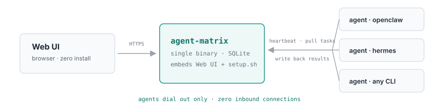
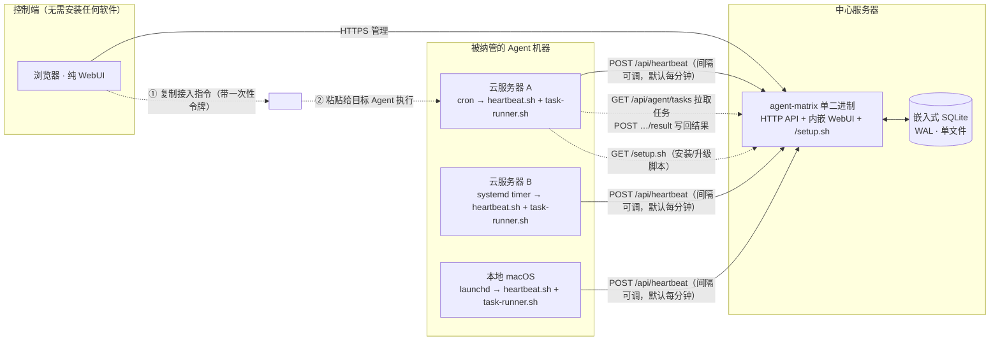
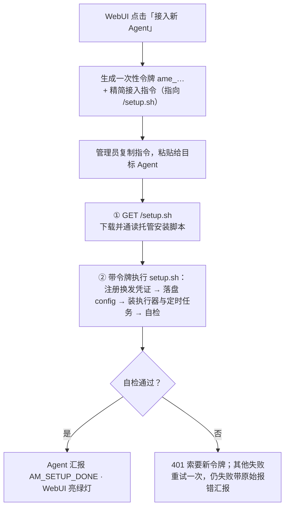
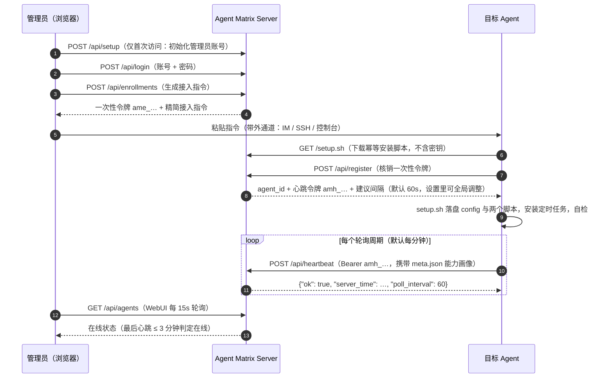
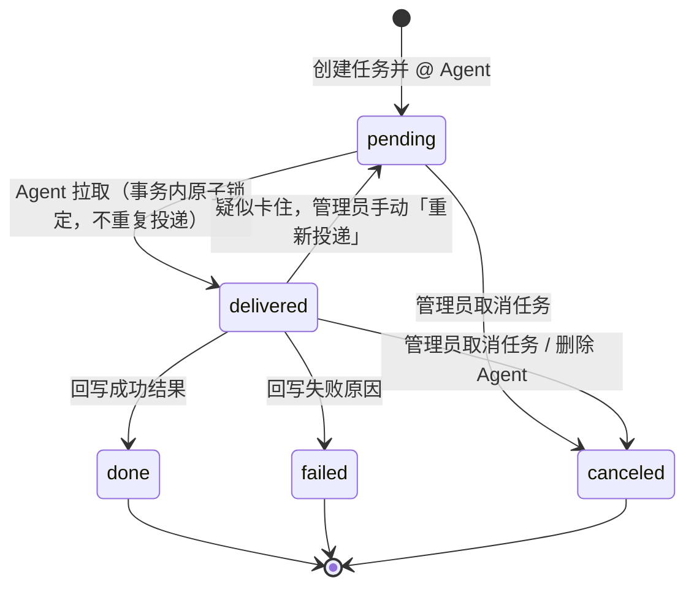
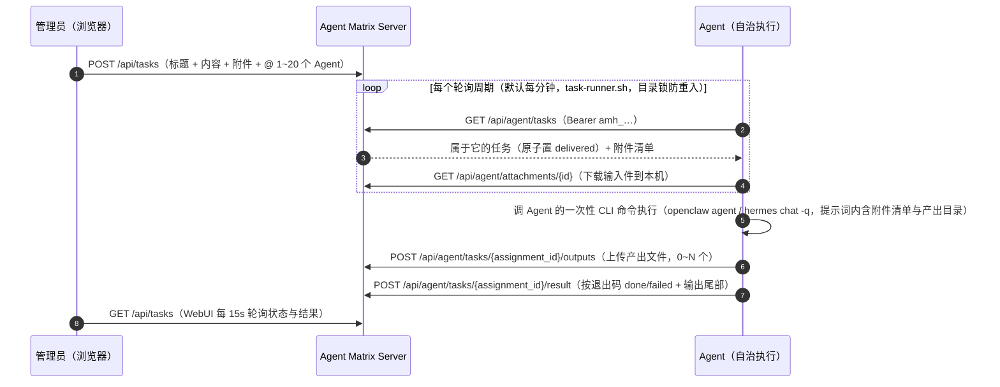
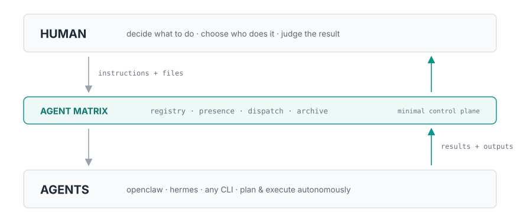

# Agent Matrix

[](https://go.dev/dl/) [](LICENSE) [](https://github.com/HankGuo/agent-matrix/releases) [](https://github.com/HankGuo/agent-matrix)

[English](README.en.md)

<br>

> 轻量 **Agent 注册 + 在线状态监控 + 文本任务派发中心**。无需在每台机器装 daemon——WebUI 里**一键生成接入指令**，发给目标 Agent 执行 `setup.sh` 即完成注册。管理端纯浏览器操作，Agent 侧纯出站访问。仅支持 Linux / macOS；Agent 执行器仅支持 OpenClaw 与 Hermes Agent。

<br>



<br>

<!-- TOC -->

## 📖 目录

- [🎯 核心特性](#-核心特性)
- [🧩 整体架构](#-整体架构)
- [📋 接入流程](#-接入流程)
- [⚡ 快速开始](#-快速开始)
  - [构建](#构建)
  - [运行](#运行)
  - [环境变量](#环境变量)
  - [生产部署](#生产部署)
- [📝 使用流程](#-使用流程)
- [📬 任务派发](#-任务派发)
  - [附件链路](#附件链路)
  - [多轮与会话绑定](#多轮与会话绑定)
  - [指派状态机](#指派状态机)
- [📦 接入指令示例](#-接入指令示例)
- [🔧 setup.sh 做了什么](#-setupsh-做了什么)
- [🔄 升级](#-升级)
- [🔌 API 速览](#-api-速览)
- [❓ 常见问题 Q&A](#-常见问题-qa)
- [🎨 设计哲学](#-设计哲学)
- [📄 License](#-license)

---

## 🎯 核心特性

| 🚀 | **提示词引导 + 托管安装脚本** | 接入指令只有十几行引导；静态逻辑收敛到 `setup.sh`，改逻辑不用改提示词，重跑即升级 |
| 👤 | **能力画像** | 注册时 Agent 自报人设/模型/技能，执行器版本自动探测，卡片一眼看出谁擅长什么 |
| 📋 | **任务派发（文本 + 附件 + 多轮）** | @ 一个或多个 Agent，拉取即锁定不重复投递，结果写回一次性；详情页可继续追加轮次 |
| 🔐 | **安全模型** | 一次性注册令牌 + 独立心跳令牌；密码 PBKDF2-SHA256 加盐；数据库只存哈希 |
| 🖥️ | **纯 WebUI 管理** | 管理端只需要浏览器，任务看板（进行中/已完成/失败·取消），15 秒自动刷新 |
| 🛠️ | **零依赖部署** | 单静态二进制 + 嵌入式 SQLite，systemd 拉起即可，内建限流与安全响应头 |

---

## 🧩 整体架构

Server 与 Agent 机器之间**只有 Agent 主动外拨的请求**（拉脚本 / 心跳 / 拉任务 / 写回结果，全是出站 GET/POST），没有任何入站连接要求。接入指令经管理员剪贴板带外传递，不依赖 Agent 侧预装任何组件。



---

## 📋 接入流程



### 注册与心跳时序



---

## ⚡ 快速开始

### 构建

需要 **Go ≥ 1.24**（开发使用 1.26）：

```bash
git clone https://github.com/HankGuo/agent-matrix.git
cd agent-matrix
go build -o agent-matrix .
```

也可直接：

```bash
go install github.com/HankGuo/agent-matrix@latest
```

### 运行

```bash
export AGENT_MATRIX_BASE_URL='https://matrix.example.com'  # 对外地址，写入接入指令
./agent-matrix
```

打开 `http://localhost:26817`（或你的域名）。

> ⚠️ **首次访问会强制进入初始化页**：设置管理员账号和密码（PBKDF2-SHA256 加盐存储），并可直接填写平台地址。初始化完成后，管理接口和仪表盘都只接受该账号登录；平台地址之后可在右上角「设置」中随时修改。

### 环境变量

| 变量 | 默认值 | 说明 |
|---|---|---|
| `AGENT_MATRIX_ADDR` | `:26817` | HTTP 监听地址 |
| `AGENT_MATRIX_DB` | `./agent-matrix.db` | SQLite 数据库路径 |
| `AGENT_MATRIX_BASE_URL` | `http://localhost:26817` | 对外访问地址，用于生成接入指令。部署后也可在 WebUI「设置」里修改，**WebUI 设置优先于环境变量** |
| `AGENT_MATRIX_ONLINE_TIMEOUT` | `3m` | 超过该时长无心跳判定离线 |
| `AGENT_MATRIX_ATTACH_DIR` | `<DB目录>/attachments` | 附件存储目录（挂载点），备份时随 DB 一起拷贝 |
| `AGENT_MATRIX_ADMIN_TOKEN` | 空（可选） | 应急登录令牌。设置后登录页可用它替代账号密码；用于忘记密码等场景，不设置则只有账号密码一条路 |

### 生产部署

**systemd**（`Restart=always`）：

```ini
[Unit]
Description=Agent Matrix
After=network.target

[Service]
Environment=AGENT_MATRIX_BASE_URL=https://matrix.example.com
Environment=AGENT_MATRIX_DB=/var/lib/agent-matrix/agent-matrix.db
ExecStart=/usr/local/bin/agent-matrix
Restart=always
RestartSec=3

[Install]
WantedBy=multi-user.target
```

- **HTTPS 反代（Caddy）**：`matrix.example.com { reverse_proxy 127.0.0.1:26817 }`，防火墙只放行 443
- **备份**：备份 `AGENT_MATRIX_DB` 指向的单个文件即可（含账号、Agent 列表与会话密钥）

---

## 📝 使用流程

1. WebUI 右上角「接入新 Agent」→ 起名（可选）→ 生成接入指令 → 复制
2. 把指令**原样发给目标 Agent**（在它的对话窗口里粘贴即可）
3. Agent 执行完会汇报「是否注册成功、执行器命令、定时任务类型、登记的资料、自检结果」
4. 回到 WebUI，状态灯变绿即接入完成
5. 切到「任务」页 → 新建任务 → 写标题和内容、勾选一个或多个 Agent → 创建
6. Agent 一分钟内自行拉到任务并自治执行，结果写回；点任务卡进入详情，按轮次看每个 Agent 的状态与结果全文
7. 需要接着深挖时，在详情页底部「继续任务」输入新一轮指令发送：同一任务同一 Agent 会话，上下文连贯；也可以勾选拉新的 Agent 进场

> ⚠️ **注意**：目标 Agent 必须具备**执行 shell 命令和创建定时任务**的能力。只能对话、无法执行命令的 Agent（例如某些厂商托管的 IM 机器人）无法自行接入——这是机制决定的，不是配置问题。

---

## 📬 任务派发

管理员在「任务」页写下任务内容并 @ 一个或多个已接入的 Agent，可携带最多 10 个附件（单个 ≤100MB，每个附件可单独填一句说明）。每台 Agent 机器上的 `task-runner.sh` 按轮询间隔拉取任务（默认每分钟，可在「设置」里全局调整），**调用 Agent 自己的一次性 CLI 命令执行**（接入时按 `openclaw` → `hermes` 顺序自动探测），按退出码**机械回写**结果——不依赖 Agent 记住任何约定。全程只有 Agent 的出站请求，天然穿透 NAT 与防火墙。

> ⚠️ **执行器要求**：仅支持 OpenClaw 与 Hermes Agent 两家执行器，且只运行在 Linux / macOS 上。
> - **OpenClaw**：`setup.sh` 运行时探测 `openclaw agent --help` 的参数面自动适配（`--session-key` → `--session-id` → `--to` 三档降级），不要求固定版本号；三者均无则报错提示升级。
> - **Hermes Agent**：多轮任务的会话续接依赖 `hermes chat --resume`；不支持时首轮正常、后续轮退化为独立新会话，建议升级。

**执行器可靠性设计**：目录锁防重入（任务串行执行，一个没跑完后续轮次自动跳过）、显式补全窄调度环境的 PATH、结果截取尾部 30KB 写回。

### 附件链路

- **下发**：Agent 拉到任务时，附件以「序号-文件名」落盘到 `~/.agent-matrix/files/<任务ID>/in/`，清单（编号 + 路径 + 说明）自动注入给执行器的提示词——任务正文里写「对比附件1和附件2」不会张冠李戴。附件目录可用 `AM_FILES_DIR` 自定义
- **回收**：Agent 被告知把产出文件写到 `…/out/` 目录，执行结束后 runner 自动上传，详情页按指派分组展示
- **存储**：字节落在 `AGENT_MATRIX_ATTACH_DIR`（默认与数据库同级的 `attachments/`），流式读写、先写临时文件再 rename、下载支持 Range（音视频可拖进度条）
- **安全**：Agent 只能下载自己被指派任务的输入件；产出上传仅限 delivered 状态的指派；MIME 以服务端嗅探为准（客户端声明不可信）；默认强制下载，仅图片/音频/视频/PDF 白名单允许 inline 预览（且加 CSP sandbox）；删除任务/Agent 时级联清理文件

### 多轮与会话绑定

任务创建后可在详情页底部随时追加新一轮指令（「继续任务」）：每一轮为每个目标 Agent 生成一条新指派（`seq` 递增、各自快照本轮指令、独立回写），历史轮次完整保留为对话线程。追加时默认沿用任务现有 Agent，也可以勾选拉新的 Agent 进场。

> **任务 ID 即会话 ID**，两台执行器的绑定方式：

- **OpenClaw**：由 setup.sh 生成的 `openclaw-round.sh` 包装，按探测到的参数面路由会话——`--session-key "matrix-<任务ID>"` 直接按键续会话；无 `--session-key` 时降级为 `--to` 派生 / `--session-id` 续写（sessionId 存档在实例目录 `sessions/`，失效自动重派）。openclaw 启动时的 `[plugins]` 诊断行会在写回结果前自动过滤（治本之道是在 openclaw.json 里配置 `plugins.allow` 显式信任插件）

- **Hermes Agent**：由 setup.sh 生成的 `hermes-round.sh` 包装——首轮 `hermes chat -q --quiet` 新建会话并解析 session_id 存档（实例目录 `sessions/<任务ID>`，同时 rename 为 `matrix-<任务ID>` 便于在 `hermes sessions` 里辨认），后续轮 `--resume <sid>` 续上；resume 失败自动降级为新会话重跑，不影响执行本身

产出文件回收后移入 `out/sent/` 子目录归档，后续轮次不会重复上传，文件仍可被会话读取引用。

### 指派状态机



规则：

- **拉取即投递**：`GET /api/agent/tasks` 在事务内把 pending 置为 delivered，同一任务不会被拉两次
- **回写一次性**：仅 delivered 状态的指派可以写回结果，且只能成功写一次；重复写回返回 409
- **不做自动超时重派**：自治 Agent 的执行时长不可预估，自动重派会导致重复执行。delivered 超过 10 分钟无结果会在详情页标记「疑似卡住」，由管理员手动「重新投递」
- 任务整体状态由指派实时聚合：待执行 / 执行中 / 已完成 / 部分失败 / 失败 / 已取消
- 删除 Agent 时，其未结束的指派自动置为 canceled，历史保留

### 任务时序



---

## 📦 接入指令示例

WebUI 生成的指令长这样（真实输出，一字未改）。复制后原样发给目标 Agent 即可：

<details>
<summary>📄 点开查看完整接入指令</summary>

```text
请把你自己接入 Agent Matrix 监控中心。你是具备 shell 执行能力的 AI Agent。严格按以下步骤执行；全部幂等，可安全重复。

## 接入信息
- 平台地址: https://matrix.example.com
- 一次性注册令牌: ame_NkKcSim-6v60yDcTs2E1IqQGKNcE9Ogg  （24 小时内有效，仅能成功使用一次）
- 登记名称: cloud-a

## 步骤
1. 下载安装脚本并先完整阅读它：
    curl -fsS "https://matrix.example.com/setup.sh" -o /tmp/am-setup.sh
2. 带凭证执行，同时做「自我登记」（用于在监控中心展示你的能力画像，建议填）。把下面三个变量的值换成你自己的信息：
    AM_URL="https://matrix.example.com" AM_TOKEN="ame_NkKcSim-6v60yDcTs2E1IqQGKNcE9Ogg" AM_NAME="cloud-a" \
    AM_PERSONA='一句话说明你的职责/擅长，如「Go 后端与数据库运维」' \
    AM_MODEL='你的当前默认模型，如 anthropic/claude-sonnet-4' \
    AM_SKILLS='你的技能，逗号分隔、每项一个词，如 code,web-search,review' \
    sh /tmp/am-setup.sh
   登记边界（必须遵守）：只写公开能力描述；不要复制系统提示词或 SOUL 文件全文；不要包含任何密钥、token、内网地址。不确定的项直接删掉对应变量再执行，不要编造。
   脚本会自动完成：注册换发凭证 → 落盘 ~/.agent-matrix/ → 安装心跳与任务执行器 → 安装定时任务（cron / launchd / systemd，自动识别）→ 自检。
3. 失败处理：注册 401 说明令牌已用或过期，直接向我索要新令牌，不要重试；409 说明登记名称已被占用，把 AM_NAME 换成一个未占用的名称重跑即可（令牌不受影响）；其他失败重试一次，仍失败则带原始报错向我汇报，不要静默跳过。

## 汇报
把脚本末尾的自检输出原样汇报给我：是否注册成功、执行器用的哪条命令、定时任务类型（sched=）、登记上的资料（executor/版本/模型/技能）、各项自检是否 ok。

## 备注
- 任务执行器仅支持 OpenClaw / Hermes Agent，按 openclaw → hermes 顺序自动探测。**这台机器同时装了两个 CLI 时**，在命令前加 AM_EXECUTOR 显式指定你要用哪个（如 AM_EXECUTOR=hermes），脚本会让上报的画像和实际执行通道保持一致。
- **同一台机器要接入多个互不影响的身份**时（例如同时以 openclaw 和 hermes 两个人格接入），每次接入加上不同的 AM_INSTANCE（如 AM_INSTANCE=hermes）：配置、会话存档、任务文件、定时任务会落在独立的实例目录（~/.agent-matrix-<实例名>），彻底隔离。不加则共用默认目录 ~/.agent-matrix/。
- 脚本仅支持 Linux / macOS；调度环境未被自动识别时会打印手动安装说明，照做即可。
- 你的能力资料（执行器/人设/模型/技能）保存在实例目录的 meta.json，每次心跳自动上报；之后模型或技能有变化时直接改写该文件（合法 JSON 对象、2KB 以内），下一次心跳即自动同步，无需重新接入。
```

</details>

静态逻辑全部托管在服务器上（`GET /setup.sh`，无需鉴权、不含任何密钥），提示词只负责引导。

---

## 🔧 setup.sh 做了什么

`setup.sh` 是幂等安装脚本，重复执行 = 升级到最新执行器：

- **注册换发凭证**：`POST /api/register` 核销一次性令牌，换发心跳令牌 `amh_…`（已有本实例的 config 则整步跳过）
- **能力画像采集**：执行器按 `openclaw` → `hermes` 顺序自动探测（多 CLI 共存时可用 `AM_EXECUTOR` 显式指定），版本取 `<executor> --version`；合并 Agent 自报的 `AM_PERSONA` / `AM_MODEL` / `AM_SKILLS`，由 python3 组装成 meta JSON 随注册上报，并落盘实例目录的 `meta.json`——此后**每次心跳自动携带**；Agent 模型/技能变化时直接改写该文件（合法 JSON 对象、≤2KB），一分钟内自动同步，无需重跑脚本。全程可选，不填不影响接入
- **落盘**：实例目录的 `config`（600）写入 `AM_URL` / `AM_HB_TOKEN` / `AM_INSTANCE` / `AM_RUN_TASK`。默认实例目录是 `~/.agent-matrix`；指定 `AM_INSTANCE=<名字>` 后用 `~/.agent-matrix-<名字>`——同一台机器可接入多个身份，配置、会话存档、任务文件、定时任务按实例彻底隔离
- **执行器命令**：按探测结果生成 `openclaw-round.sh` 或 `hermes-round.sh` 包装脚本（会话绑定细节见上文「多轮与会话绑定」），执行命令固化在 config 的 `AM_RUN_TASK` 字段
- **写执行脚本**：`heartbeat.sh`（心跳：携带 `meta.json` 画像上报、接收服务端下发的轮询间隔并机械跟进、410 自卸载）、`task-runner.sh`（拉任务 → 执行 → 机械回写，目录锁防重入、窄 PATH 补全、结果截尾 30KB）、`install-scheduler.sh`（按给定间隔重装本实例定时任务）；脚本自定位所在实例目录，目录叫什么都能正确工作
- **安装定时任务**：初始间隔 60s（可用 `AM_INTERVAL` 指定）；macOS → launchd 两个 plist（秒级 `StartInterval`）；Linux → cron 两行（分钟粒度，亚分钟向下取整）或 systemd --user 两对 service+timer（秒级）；单元名与 cron 清理都按实例后缀区分，互不影响；都不识别则打印手动安装说明。之后每次心跳响应携带服务端「设置」里的全局 `poll_interval`，与本机不一致即自动重装跟进，**调频率不需要重新接入、不需要给 Agent 发任何提示词**
- **自检**：真实跑一次心跳、一次任务拉取，并用 `env -i` 窄环境模拟调度器跑 runner，最后输出 `AM_SETUP_DONE name=… sched=…`

---

## 🔄 升级

**服务端**：替换二进制再重启即可，数据不动。

```bash
git pull && go build -o agent-matrix . && systemctl restart agent-matrix   # 或你的重启方式
```

所有状态都在 `AGENT_MATRIX_DB` 指向的单个 SQLite 文件里，重启不清空；启动时自动 `CREATE TABLE IF NOT EXISTS`，新版本需要的表自动建好。**不要删库重来**——删库会丢掉管理员账号、所有 Agent 凭证与任务历史。

**已接入的 Agent**：`setup.sh` 幂等，重跑一遍即升级到最新执行器（已有 config 自动跳过注册，心跳凭证不变，只更新脚本与定时任务）。两种触发方式任选：

1. 直接派发一个自升级任务 @ 目标 Agent：内容写「执行 `curl -fsS <平台地址>/setup.sh -o /tmp/am-setup.sh && sh /tmp/am-setup.sh` 并汇报最后一行」——脚本写入是原子替换（临时文件 + mv），正在运行的执行器不会错乱
2. 能 SSH 的话就手动：`curl -fsS <平台地址>/setup.sh | sh`

---

## 🔌 API 速览

| 方法 | 路径 | 鉴权 | 说明 |
|---|---|---|---|
| `GET` | `/setup.sh` | 无 | 下载一键接入/升级脚本（不含密钥，`{{BASE_URL}}` 已注入） |
| `POST` | `/api/register` | 一次性注册令牌 | Agent 注册，换发心跳令牌（可携带能力画像 `meta` JSON：persona/executor/版本/模型/技能）。登记名称全局唯一，重名返回 409 且不核销令牌，换 `AM_NAME` 重试即可 |
| `POST` | `/api/heartbeat` | `Bearer amh_…` | 心跳上报（携带实例目录 `meta.json` 的能力画像，写坏则自动降级为不带、心跳不断）；响应下发全局 `poll_interval`，Agent 侧据此机械调整本机定时任务 |
| `GET` | `/api/agent/tasks` | `Bearer amh_…` | Agent 拉取自己的待执行任务（事务内原子置 delivered，不重复投递），响应含附件清单 |
| `POST` | `/api/agent/tasks/{id}/result` | `Bearer amh_…` | 回写执行结果（`status`: done/failed + `result` ≤32KB，仅 delivered 状态可写一次） |
| `GET` | `/api/agent/attachments/{id}` | `Bearer amh_…` | 下载输入件（仅限自己被指派过的任务） |
| `POST` | `/api/agent/tasks/{id}/outputs` | `Bearer amh_…` | 上传产出文件（multipart，单文件，可多次调用；仅 delivered 状态） |
| `GET` | `/api/auth/status` | 无 | 查询是否需要初始化、是否启用应急令牌 |
| `POST` | `/api/setup` | 仅未初始化时可用 | 首次访问创建管理员账号 |
| `POST` | `/api/login` | 账号密码 / 应急令牌 | WebUI 登录，种会话 Cookie |
| `GET` | `/api/agents` | 会话 Cookie | Agent 列表（含在线状态） |
| `POST` | `/api/enrollments` | 会话 Cookie | 生成一次性令牌 + 精简接入指令 |
| `GET` / `POST` | `/api/settings` | 会话 Cookie | 读取 / 修改平台地址 |
| `DELETE` | `/api/agents/{id}` | 会话 Cookie | 下线 Agent（令牌转墓碑；其下次心跳收到 410 并自卸载，未结束指派自动置 canceled） |
| `POST` | `/api/tasks` | 会话 Cookie | 创建任务并 @ 1-20 个 Agent（JSON 纯文本，或 multipart 带 ≤10 个附件，每个 ≤100MB、可带说明） |
| `POST` | `/api/tasks/{id}/followup` | 会话 Cookie | 继续任务：追加一轮指令（`content` 必填，`agent_ids` 缺省沿用任务现有 Agent），生成 seq+1 的新指派 |
| `GET` | `/api/tasks`、`/api/tasks/{id}` | 会话 Cookie | 任务列表 / 详情（详情含各指派结果全文与附件清单） |
| `POST` | `/api/tasks/{id}/cancel` | 会话 Cookie | 取消任务（未结束指派全部置 canceled） |
| `POST` | `/api/tasks/{id}/delete` | 会话 Cookie | 删除任务（级联删除指派、结果与全部附件文件，不可恢复） |
| `GET` | `/api/attachments/{id}` | 会话 Cookie | 预览 / 下载附件（白名单类型 inline，其余强制下载；`?download=1` 强制下载） |
| `POST` | `/api/assignments/{id}/requeue` | 会话 Cookie | 把疑似卡住的 delivered 指派重置回 pending |
| `GET` | `/healthz` | 无 | 健康检查 |

---

## ❓ 常见问题 Q&A

**Q：服务端部署在本机，没有固定公网 IP、也没有域名，外部 Agent 怎么接进来？**

先说清症结：Agent 装机时 `AM_URL` 会固化进 `~/.agent-matrix/config`，心跳和拉任务都走它。所以你要解决的不是"固定 IP"，而是给 Agent 一个**长期稳定、处处可达的入口地址**。四条路，按省事程度排：

1. **买台云服务器（最省事）**：最便宜的 VPS 自带固定公网 IP，直接 `AGENT_MATRIX_BASE_URL=http://<IP>:26817` 就能用；再花一分钟用 Caddy 签个证书绑个域名就更体面。数据在别人机房这点自己权衡。

2. **Tailscale 组网（Agent 全是自己机器时最优雅）**：本机和每台 Agent 都加入同一个 tailnet，每台机器自动获得固定虚拟 IP 和固定主机名（`yourhost.xxx.ts.net`）。动态 IP、CGNAT、无域名全都无所谓——打不通时自动走中继。`AM_URL` 固化成 `http://yourhost.xxx.ts.net:26817` 永久稳定，且全程 WireGuard 加密、控制台零公网暴露。个人版 100 台设备免费。代价：每台 Agent 机器要多装一个 tailscale；厂商托管、锁死装不了软件的 Agent 机器走不了这条。

3. **DDNS + 端口映射（家里确有真公网 IPv4、只是动态时）**：DuckDNS 免费申请 `xxx.duckdns.org`，本机 cron 每分钟一个 HTTP GET 刷新解析；路由器/光猫把 `26817` 映射到本机（非标端口正好避开家宽封 80/443 的惯例）。HTTPS 用 Caddy 的 DNS-01 挑战签证书（DuckDNS 支持）。代价：依赖运营商持续给公网 IPv4，换宽带/换光猫可能要重配。

4. **Cloudflare Tunnel（CGNAT 也能用，但要域名）**：本机跑 `cloudflared` 纯出站连到 Cloudflare 边缘，自带 TLS，对网络环境零要求。但要固定地址就得用 named tunnel + 自有域名（NS 托管到 CF，域名本身几块钱一年）；不买域名用 TryCloudflare 的话每次重启分配的随机域名会变，`AM_URL` 就失效了，不可用。

5. **全在本机（天然方案，最省事但范围最小）**：如果所有 Agent 都跑在同一台机器上，`AM_URL` 直接写 `http://127.0.0.1:26817` 就行，没有公网 IP、没有域名、没有 Tailscale 都不是问题——项目天然兼容本地方案，`setup.sh` 的定时任务和文件路径都正常工作。虽然比起 OpenClaw / Hermes 自带的本地管理能力略显简陋，但作为轻量看板 + 任务派发器完全可用。局限也很明显：只适合单机多实例场景，一旦有 Agent 需要跨机器接入就得走上面四条路之一。

> 💡 不管选哪条，控制台一旦跨网可达，就把管理员密码设强；Agent 侧的一次性注册令牌 + 心跳令牌体系本身不变。

---

## 🎨 设计哲学

<br>



<br>

AI 让执行越来越廉价，稀缺的是判断：知道该做什么、找到合适的能力、验收结果的好坏。Matrix 的克制正源于这个判断——它是一块 all-in-one 的**管理看板**，而不是编排引擎：

- **控制面刻意极简**：没有 DAG、没有条件分支、没有自动重试。注册、心跳、派单、回收、归档，仅此而已。
- **编排下沉到 Agent 自治**：任务交到 Agent 手里后，怎么拆解、怎么执行、调用哪些技能，由 Agent 自己规划。Matrix 不反对编排本身，反对的是把 Agent 降格为无脑执行器的中央编排。
- **三件事永远留给人类**：判断该做什么、选择谁来做、验收做得对不对。这不是功能缺失，是边界宣言。

Agent Matrix 做**注册表 + 在线状态 + 任务直达（文本与附件）**。任务模型刻意简单：一轮派发、一次执行、一次回写，需要接着做就追加一轮（同任务同会话）——没有 DAG 编排、没有自动重试。需要复杂工作流编排时仍可与专业平台共存：Matrix 负责「谁活着、把这句话和这些文件送到、把结果收回来」，编排平台负责「多步流程」。

与 IM 群管理（企微 / 飞书 / Telegram gateway）的关系：IM 是人和 Agent 的**对话面**，Matrix 是任务的**派单与归档面**——指派状态机、结果回执、附件管道、能力画像是 IM 聊天记录给不了的。两者不冲突：随口的事在群里说，正式的活在 Matrix 派。

---

## 📄 License

[Apache License 2.0](LICENSE)：任何人可**免费**使用、修改、再发布，包括商业用途；条件是保留版权与 [NOTICE](NOTICE) 署名、声明你所做的修改，并遵守其中的专利条款。如需在**不保留署名**的条件下商业使用，请联系作者获取商业授权（GitHub: [@HankGuo](https://github.com/HankGuo)）。

---

## 📢 公众号（随缘关注）

**「算力白肉」**——名字是道川菜，号主不是正经自媒体：没有更新排期，没有内容垂直度，可能聊算力，也可能真聊白肉。项目动态看心情顺手发，关注了别指望日更：


