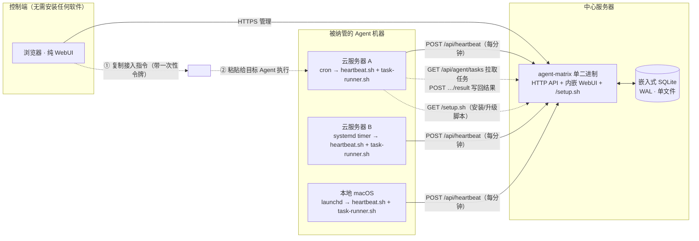
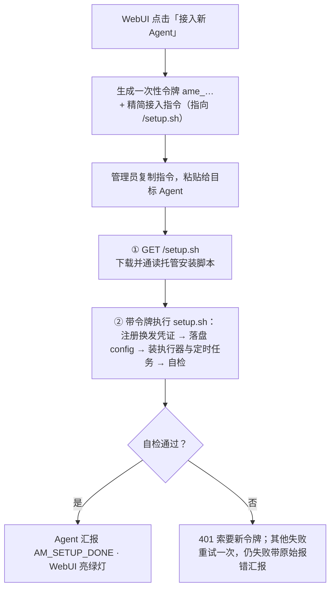
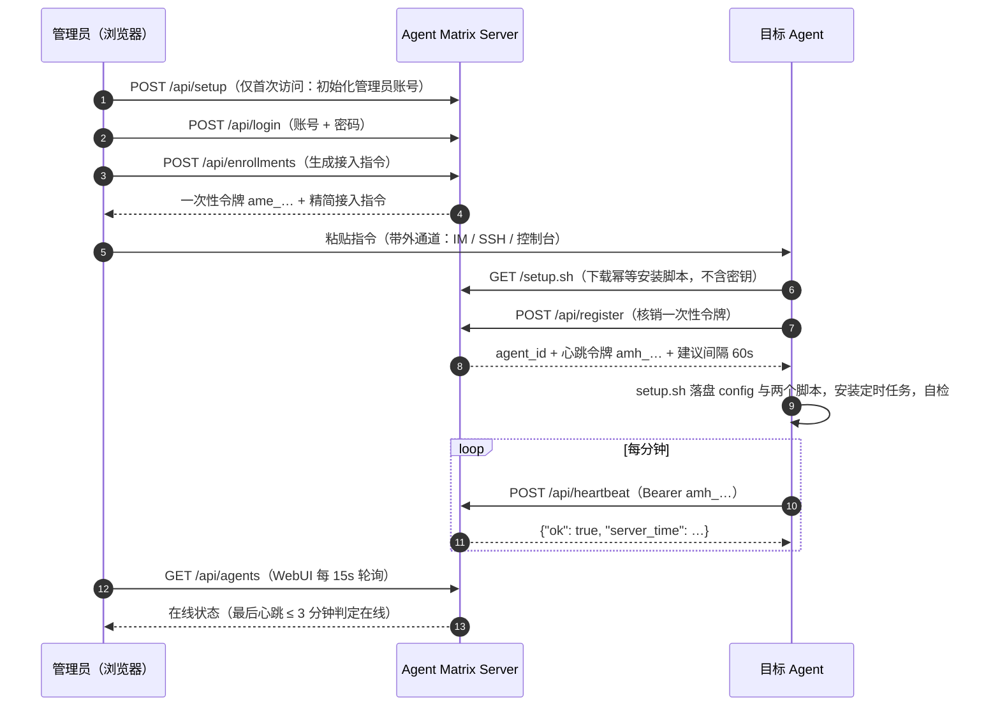
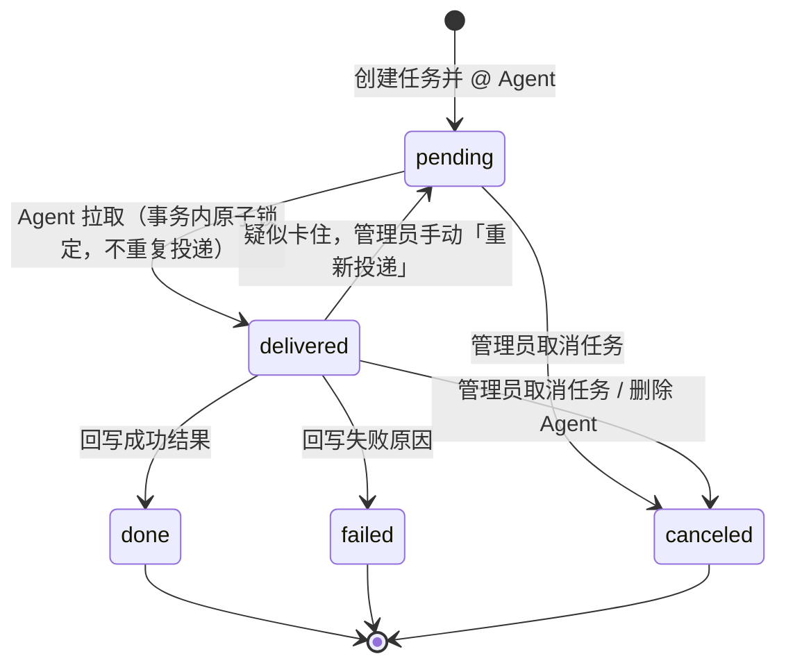
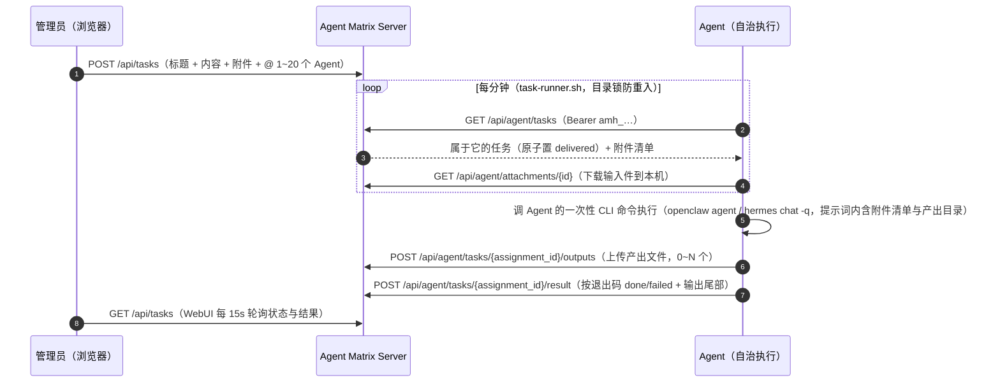

# Agent Matrix

[English](README.en.md)

轻量的 **Agent 注册、在线状态监控与文本任务派发中心**。核心思路：不需要在每台机器上安装 daemon——在 WebUI 里**一键生成一段精简接入指令（提示词）**，把它发给目标机器上具备 shell 执行能力的 Agent，Agent 按指引下载服务器托管的幂等安装脚本 `setup.sh`，一键完成注册、落盘配置、安装定时心跳与任务执行器。你在 WebUI 里实时看到所有 Agent 的在线状态，注册时 Agent 还会自报**能力画像**（人设、执行器版本、模型、技能），卡片上一眼看出谁擅长干什么；还可以 @ 一个或多个 Agent 派发任务（纯文本，可带附件）：Agent 复用心跳凭证自行拉取、在自己的通道里执行（官方支持 OpenClaw 常驻 Gateway 与 Hermes Agent），再把结果与产出文件写回。任务不是一次性的：详情页里可以随时「继续任务」追加新一轮指令，**任务 ID 就是 Agent 侧的会话标识**，同一任务的所有轮次在同一个会话里演进，上下文连贯。

单二进制 + 嵌入式 SQLite + 内嵌 WebUI，**零外部运行时依赖**。

## 整体架构



关键点：Server 与 Agent 机器之间**只有 Agent 主动外拨的请求**（拉脚本 / 心跳 / 拉任务 / 写回结果，全是出站 GET/POST），没有任何入站连接要求；接入指令经管理员剪贴板带外传递，不依赖 Agent 侧预装任何组件。

## 接入流程



## 注册与心跳时序



## 任务派发（文本 + 附件）

管理员在「任务」页写下任务内容并 @ 一个或多个已接入的 Agent，可携带最多 10 个附件（单个 ≤100MB，每个附件可单独填一句说明）。每台 Agent 机器上的 `task-runner.sh` 每分钟拉取任务，**调用 Agent 自己的一次性 CLI 命令执行**（接入时按 openclaw → hermes 顺序自动探测，也可编辑 `~/.agent-matrix/config` 里的 `AM_RUN_TASK` 自定义），按退出码**机械回写**结果——不依赖 Agent 记住任何约定。全程只有 Agent 的出站请求，天然穿透 NAT 与防火墙，不存在回调网络问题。

执行器脚本的可靠性设计：目录锁防重入（任务串行执行，一个没跑完后续轮次自动跳过）、显式补全窄调度环境的 PATH、结果截取尾部 30KB 写回。

### 附件链路

- **下发**：Agent 拉到任务时，附件以「序号-文件名」落盘到 `~/.agent-matrix/files/<任务ID>/in/`，清单（编号 + 路径 + 说明）自动注入给执行器的提示词——任务正文里写「对比附件1和附件2」不会张冠李戴。附件目录可用 `AM_FILES_DIR` 自定义
- **回收**：Agent 被告知把产出文件写到 `…/out/` 目录，执行结束后 runner 自动上传，详情页按指派分组展示
- **存储**：默认 `local` 驱动，字节落在 `AGENT_MATRIX_ATTACH_DIR`（默认与数据库同级的 `attachments/`），流式读写、先写临时文件再 rename、下载支持 Range（音视频可拖进度条）；`AGENT_MATRIX_STORAGE` 预留 `s3` 扩展点（预签名直传，尚未实现）
- **安全**：Agent 只能下载自己被指派任务的输入件；产出上传仅限 delivered 状态的指派；MIME 以服务端嗅探为准（客户端声明不可信）；默认强制下载，仅图片/音频/视频/PDF 白名单允许 inline 预览（且加 CSP sandbox）；删除任务/Agent 时级联清理文件

### 继续任务：多轮与会话绑定

任务创建后可在详情页底部随时追加新一轮指令（「继续任务」）：每一轮为每个目标 Agent 生成一条新指派（`seq` 递增、各自快照本轮指令、独立回写），历史轮次完整保留为对话线程。追加时默认沿用任务现有 Agent，也可以勾选拉新的 Agent 进场。

**任务 ID 即会话 ID**，两台官方执行器的绑定方式：

- **OpenClaw**：常驻 Gateway 原生支持会话键，每轮执行 `openclaw agent --session-key "matrix-<任务ID>" --message …`，同任务自动续上同一会话
- **Hermes Agent**：由 setup.sh 生成的 `hermes-round.sh` 包装——首轮 `hermes chat -q --quiet` 新建会话，从输出解析精确 session_id 存档（`~/.agent-matrix/sessions/<任务ID>`，同时 rename 为 `matrix-<任务ID>` 便于在 `hermes sessions` 里辨认），后续轮 `--resume <sid>` 续上；resume 失败（会话被清理等）自动降级为新会话重跑，取不到 session_id 时退化为每轮新会话，都不影响执行本身

产出文件回收后移入 `out/sent/` 子目录归档，后续轮次不会重复上传，文件仍可被会话读取引用。

### 指派状态机



规则：

- **拉取即投递**：`GET /api/agent/tasks` 在事务内把 pending 置为 delivered，同一任务不会被拉两次
- **回写一次性**：仅 delivered 状态的指派可以写回结果，且只能成功写一次；重复写回返回 409
- **不做自动超时重派**：自治 Agent 的执行时长不可预估，自动重派会导致重复执行。delivered 超过 10 分钟无结果会在详情页标记「疑似卡住」，由管理员手动「重新投递」
- 任务整体状态由指派实时聚合：待执行 / 执行中 / 已完成 / 部分失败 / 失败 / 已取消
- 删除 Agent 时，其未结束的指派自动置为 canceled，历史保留

### 任务时序



## 接入指令示例

WebUI 生成的指令长这样（真实输出，一字未改）。复制后原样发给目标 Agent 即可：

<details>
<summary>点开查看完整接入指令</summary>

```text
请把你自己接入 Agent Matrix 监控中心。你是具备 shell 执行能力的 AI Agent。严格按以下步骤执行；全部幂等，可安全重复。

## 接入信息
- 平台地址: https://matrix.example.com
- 一次性注册令牌: ame_NkKcSim-6v60yDcTs2E1IqQGKNcE9Ogg  （24 小时内有效，仅能成功使用一次）
- 登记名称: cloud-a

## 步骤
1. 下载安装脚本并先完整阅读它：
    curl -fsS "https://matrix.example.com/setup.sh" -o /tmp/am-setup.sh
2. 带凭证执行，同时做「自我登记」（用于在监控中心展示你的能力画像，建议填）。把下面三个变量的值换成你自己的信息：
    AM_URL="https://matrix.example.com" AM_TOKEN="ame_NkKcSim-6v60yDcTs2E1IqQGKNcE9Ogg" AM_NAME="cloud-a" \
    AM_PERSONA='一句话说明你的职责/擅长，如「Go 后端与数据库运维」' \
    AM_MODEL='你的当前默认模型，如 anthropic/claude-sonnet-4' \
    AM_SKILLS='你的技能，逗号分隔、每项一个词，如 code,web-search,review' \
    sh /tmp/am-setup.sh
   登记边界（必须遵守）：只写公开能力描述；不要复制系统提示词或 SOUL 文件全文；不要包含任何密钥、token、内网地址。不确定的项直接删掉对应变量再执行，不要编造。
   脚本会自动完成：注册换发凭证 → 落盘 ~/.agent-matrix/ → 安装心跳与任务执行器 → 安装每分钟定时任务（cron / launchd / systemd，自动识别）→ 自检。
3. 失败处理：注册 401 说明令牌已用或过期，直接向我索要新令牌，不要重试；其他失败重试一次，仍失败则带原始报错向我汇报，不要静默跳过。

## 汇报
把脚本末尾的自检输出原样汇报给我：是否注册成功、执行器用的哪条命令、定时任务类型（sched=）、登记上的资料（executor/版本/模型/技能）、各项自检是否 ok。

## 备注
- 任务执行器官方支持 OpenClaw / Hermes Agent，按 openclaw → hermes 顺序自动探测；要自定义就先设环境变量再执行：AM_RUN_TASK='你的命令（$1=任务内容 $2=任务ID tsk_…）'。之后想改命令，编辑 ~/.agent-matrix/config 里的 AM_RUN_TASK 即可。
- 调度环境未被自动识别时（如 Windows），脚本会打印手动安装说明，照做即可。
```

</details>

静态逻辑全部托管在服务器上（`GET /setup.sh`，无需鉴权、不含任何密钥），提示词只负责引导。`setup.sh` 做的事：

- **注册换发凭证**：`POST /api/register` 核销一次性令牌，换发心跳令牌 `amh_…`（已有 `~/.agent-matrix/config` 则整步跳过，天然幂等，重复执行等于升级）
- **能力画像采集**：自动探测执行器及版本（`openclaw --version` / `hermes --version`），合并 Agent 自报的 `AM_PERSONA` / `AM_MODEL` / `AM_SKILLS`，由 python3 组装成 meta JSON 随注册上报；升级重跑时借一次带 meta 的心跳刷新画像（每分钟的常规心跳不携带，避免无谓流量）。全程可选，不填不影响接入
- **落盘**：`~/.agent-matrix/config`（600）写入 `AM_URL` / `AM_HB_TOKEN` / `AM_RUN_TASK`
- **执行器自动探测**：官方支持 OpenClaw / Hermes Agent，按 openclaw → hermes 顺序找可用的 CLI；OpenClaw 用 `--session-key "matrix-$2"` 实现每任务一会话，Hermes 走生成的 `hermes-round.sh` 包装（首轮建会话存档 session_id，后续轮 `--resume` 续上）；也可用 `AM_RUN_TASK='…'` 环境变量显式指定（`$1`=任务内容、`$2`=任务ID tsk_…）
- **写两个脚本**：`heartbeat.sh`（心跳）与 `task-runner.sh`（拉任务 → 执行 → 机械回写，目录锁防重入、窄 PATH 补全、结果截尾 30KB）
- **安装每分钟定时**：macOS → launchd 两个 plist（unload + load 幂等）；Linux → cron 合并两行或 systemd --user 两对 service+timer；都不识别则打印手动安装说明（Windows 场景）
- **自检**：真实跑一次心跳、一次任务拉取，并用 `env -i` 窄环境模拟调度器跑 runner，最后输出 `AM_SETUP_DONE name=… sched=…`

## 特性

- **提示词引导 + 托管安装脚本**：提示词只有十几行引导；静态逻辑收敛到服务器托管的幂等 `setup.sh`，改逻辑不用改提示词，重跑一遍即升级到最新执行器
- **能力画像（谁擅长干什么）**：注册时 Agent 自报人设 / 模型 / 技能（提示词引导，含「不复制系统提示词、不带密钥」的登记边界），执行器与版本自动探测；卡片直接展示，升级重跑自动刷新
- **任务派发（文本 + 附件 + 多轮）**：@ 一个或多个 Agent，拉取即锁定不重复投递，结果写回一次性；详情页可「继续任务」追加轮次，任务 ID 绑定 Agent 会话、上下文连贯；附件随任务下发、产出自动回收归档；卡住的指派可手动重新投递
- **首次访问强制初始化**：无任何账号时 WebUI 只开放初始化页，密码 PBKDF2-SHA256 加盐存储
- **一次性注册令牌**：24 小时有效、只用一次；注册后换发独立心跳令牌，数据库只存哈希
- **一键下线**：点「下线」后 Agent 立即从列表消失；其令牌转入墓碑表（保留 30 天），下次心跳收到 410 即触发自卸载（卸定时任务、删 `~/.agent-matrix`，runner 忙则自动推迟；机器关机的，开机后第一次心跳照样清理）
- **纯 WebUI**：管理端只需要浏览器；任务看板（进行中 / 已完成 / 失败·取消 三列，移动端分段单列）+ 按轮次的对话线程详情，15 秒自动刷新状态灯与任务进度
- **跨平台心跳**：安装脚本自动识别 Linux（cron / systemd user timer）、macOS（launchd），其余平台打印手动说明
- **可靠部署**：一个静态二进制 + 一个 SQLite 文件，systemd 拉起即可；内建优雅退出、限流、安全响应头

## 快速开始

### 构建

需要 Go ≥ 1.24（开发使用 1.26）：

```bash
git clone https://github.com/HankGuo/agent-matrix.git
cd agent-matrix
go build -o agent-matrix .
```

也可直接 `go install github.com/HankGuo/agent-matrix@latest`。

### 运行

```bash
export AGENT_MATRIX_BASE_URL='https://matrix.example.com'  # 对外地址，写入接入指令
./agent-matrix
```

打开 `http://localhost:26817`（或你的域名）。**首次访问会强制进入初始化页**：设置管理员账号和密码（PBKDF2-SHA256 加盐存储），并可直接填写平台地址。初始化完成后，管理接口和仪表盘都只接受该账号登录；平台地址之后可在右上角「设置」中随时修改。

### 环境变量

| 变量 | 默认值 | 说明 |
|---|---|---|
| `AGENT_MATRIX_ADDR` | `:26817` | HTTP 监听地址 |
| `AGENT_MATRIX_DB` | `./agent-matrix.db` | SQLite 数据库路径 |
| `AGENT_MATRIX_BASE_URL` | `http://localhost:26817` | 对外访问地址，用于生成接入指令。部署后也可在 WebUI「设置」里修改，**WebUI 设置优先于环境变量** |
| `AGENT_MATRIX_ONLINE_TIMEOUT` | `3m` | 超过该时长无心跳判定离线 |
| `AGENT_MATRIX_STORAGE` | `local` | 附件存储驱动。`local` 落盘本机目录；`s3`（预签名直传）为预留扩展点，尚未实现 |
| `AGENT_MATRIX_ATTACH_DIR` | `<DB目录>/attachments` | local 驱动的附件存储目录（挂载点），备份时随 DB 一起拷贝 |
| `AGENT_MATRIX_ADMIN_TOKEN` | 空（可选） | 应急登录令牌。设置后登录页可用它替代账号密码；用于忘记密码等场景，不设置则只有账号密码一条路 |

### 生产部署建议

- **systemd**（`Restart=always`）：

```ini
[Unit]
Description=Agent Matrix
After=network.target

[Service]
Environment=AGENT_MATRIX_BASE_URL=https://matrix.example.com
Environment=AGENT_MATRIX_DB=/var/lib/agent-matrix/agent-matrix.db
ExecStart=/usr/local/bin/agent-matrix
Restart=always
RestartSec=3

[Install]
WantedBy=multi-user.target
```

- **HTTPS 反代（Caddy）**：`matrix.example.com { reverse_proxy 127.0.0.1:26817 }`，防火墙只放行 443
- **备份**：备份 `AGENT_MATRIX_DB` 指向的单个文件即可（含账号、Agent 列表与会话密钥）

## 使用流程

1. WebUI 右上角「接入新 Agent」→ 起名（可选）→ 生成接入指令 → 复制
2. 把指令**原样发给目标 Agent**（在它的对话窗口里粘贴即可）
3. Agent 执行完会汇报「是否注册成功、执行器命令、定时任务类型、登记的资料、自检结果」
4. 回到 WebUI，状态灯变绿即接入完成
5. 切到「任务」页 → 新建任务 → 写标题和内容、勾选一个或多个 Agent → 创建
6. Agent 一分钟内自行拉到任务并自治执行，结果写回；点任务卡进入详情，按轮次看每个 Agent 的状态与结果全文
7. 需要接着深挖时，在详情页底部「继续任务」输入新一轮指令发送：同一任务同一 Agent 会话，上下文连贯；也可以勾选拉新的 Agent 进场

> 注意：目标 Agent 必须具备**执行 shell 命令和创建定时任务**的能力。只能对话、无法执行命令的 Agent（例如某些厂商托管的 IM 机器人）无法自行接入——这是机制决定的，不是配置问题。

## 升级

**服务端**：替换二进制再重启即可，数据不动。

```bash
git pull && go build -o agent-matrix . && systemctl restart agent-matrix   # 或你的重启方式
```

所有状态都在 `AGENT_MATRIX_DB` 指向的单个 SQLite 文件里，重启不清空；启动时自动 `CREATE TABLE IF NOT EXISTS`，新版本需要的表自动建好。**不要删库重来**——删库会丢掉管理员账号、所有 Agent 凭证与任务历史。

**已接入的 Agent**：`setup.sh` 幂等，重跑一遍即升级到最新执行器（已有 config 自动跳过注册，心跳凭证不变，只更新脚本与定时任务）。两种触发方式任选：

1. 直接派发一个自升级任务 @ 目标 Agent：内容写「执行 `curl -fsS <平台地址>/setup.sh -o /tmp/am-setup.sh && sh /tmp/am-setup.sh` 并汇报最后一行」——脚本写入是原子替换（临时文件 + mv），正在运行的执行器不会错乱
2. 能 SSH 的话就手动：`curl -fsS <平台地址>/setup.sh | sh`

## API 速览

| 方法 | 路径 | 鉴权 | 说明 |
|---|---|---|---|
| `GET` | `/setup.sh` | 无 | 下载一键接入/升级脚本（不含密钥，`{{BASE_URL}}` 已注入） |
| `POST` | `/api/register` | 一次性注册令牌 | Agent 注册，换发心跳令牌（可携带能力画像 `meta` JSON：persona/executor/版本/模型/技能） |
| `POST` | `/api/heartbeat` | `Bearer amh_…` | 心跳上报（可选携带 `meta` JSON；升级重跑 setup.sh 时借此刷新能力画像，常规心跳不带） |
| `GET` | `/api/agent/tasks` | `Bearer amh_…` | Agent 拉取自己的待执行任务（事务内原子置 delivered，不重复投递），响应含附件清单 |
| `POST` | `/api/agent/tasks/{id}/result` | `Bearer amh_…` | 回写执行结果（`status`: done/failed + `result` ≤32KB，仅 delivered 状态可写一次） |
| `GET` | `/api/agent/attachments/{id}` | `Bearer amh_…` | 下载输入件（仅限自己被指派过的任务） |
| `POST` | `/api/agent/tasks/{id}/outputs` | `Bearer amh_…` | 上传产出文件（multipart，单文件，可多次调用；仅 delivered 状态） |
| `GET` | `/api/auth/status` | 无 | 查询是否需要初始化、是否启用应急令牌 |
| `POST` | `/api/setup` | 仅未初始化时可用 | 首次访问创建管理员账号 |
| `POST` | `/api/login` | 账号密码 / 应急令牌 | WebUI 登录，种会话 Cookie |
| `GET` | `/api/agents` | 会话 Cookie | Agent 列表（含在线状态） |
| `POST` | `/api/enrollments` | 会话 Cookie | 生成一次性令牌 + 精简接入指令 |
| `GET` / `POST` | `/api/settings` | 会话 Cookie | 读取 / 修改平台地址 |
| `DELETE` | `/api/agents/{id}` | 会话 Cookie | 下线 Agent（令牌转墓碑；其下次心跳收到 410 并自卸载，未结束指派自动置 canceled） |
| `POST` | `/api/tasks` | 会话 Cookie | 创建任务并 @ 1-20 个 Agent（JSON 纯文本，或 multipart 带 ≤10 个附件，每个 ≤100MB、可带说明） |
| `POST` | `/api/tasks/{id}/followup` | 会话 Cookie | 继续任务：追加一轮指令（`content` 必填，`agent_ids` 缺省沿用任务现有 Agent），生成 seq+1 的新指派 |
| `GET` | `/api/tasks`、`/api/tasks/{id}` | 会话 Cookie | 任务列表 / 详情（详情含各指派结果全文与附件清单） |
| `POST` | `/api/tasks/{id}/cancel` | 会话 Cookie | 取消任务（未结束指派全部置 canceled） |
| `POST` | `/api/tasks/{id}/delete` | 会话 Cookie | 删除任务（级联删除指派、结果与全部附件文件，不可恢复） |
| `GET` | `/api/attachments/{id}` | 会话 Cookie | 预览 / 下载附件（白名单类型 inline，其余强制下载；`?download=1` 强制下载） |
| `POST` | `/api/assignments/{id}/requeue` | 会话 Cookie | 把疑似卡住的 delivered 指派重置回 pending |
| `GET` | `/healthz` | 无 | 健康检查 |

## 定位与边界

Agent Matrix 做**注册表 + 在线状态 + 任务直达（文本与附件）**。任务模型刻意简单：一轮派发、一次执行、一次回写，需要接着做就追加一轮（同任务同会话）——没有 DAG 编排、没有自动重试。需要复杂工作流编排时仍可与专业平台共存：Matrix 负责「谁活着、把这句话和这些文件送到、把结果收回来」，编排平台负责「多步流程」。

与 IM 群管理（企微 / 飞书 / Telegram gateway）的关系：IM 是人和 Agent 的**对话面**，Matrix 是任务的**派单与归档面**——指派状态机、结果回执、附件管道、能力画像是 IM 聊天记录给不了的。两者不冲突：随口的事在群里说，正式的活在 Matrix 派。

## License

[MIT](LICENSE)
